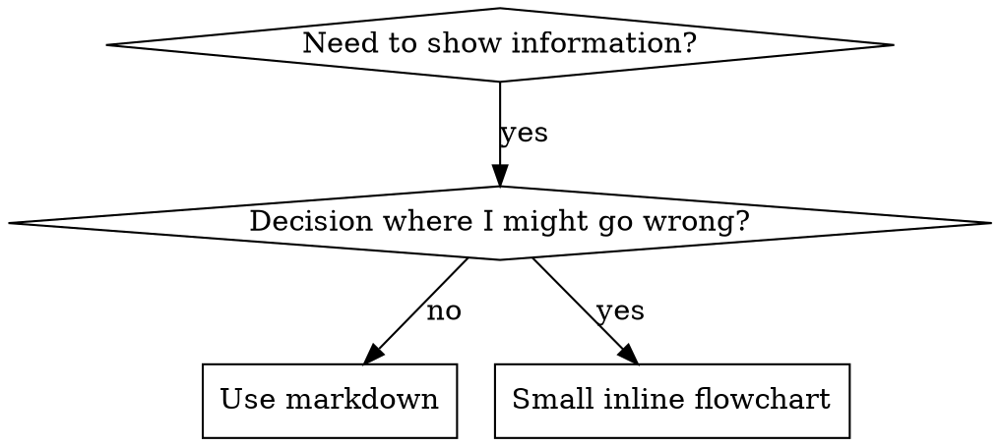

<!-- Moved verbatim from writing-skills/SKILL.md § Flowchart Usage (W4 slim-skills). Read when: deciding whether a section needs a flowchart. -->

```dot
digraph when_flowchart {
    "Need to show information?" [shape=diamond];
    "Decision where I might go wrong?" [shape=diamond];
    "Use markdown" [shape=box];
    "Small inline flowchart" [shape=box];

    "Need to show information?" -> "Decision where I might go wrong?" [label="yes"];
    "Decision where I might go wrong?" -> "Small inline flowchart" [label="yes"];
    "Decision where I might go wrong?" -> "Use markdown" [label="no"];
}
```
