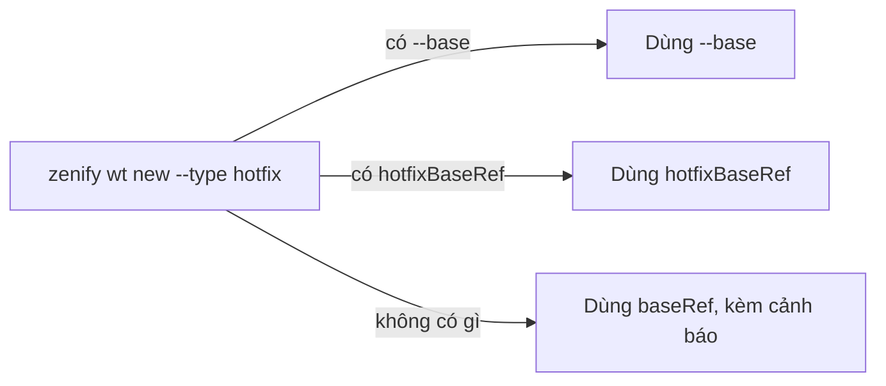

# Base ref, hotfix base, port block

## Tổng quan

Mỗi repo trong workspace có một branch tích hợp riêng (`staging`, `develop`, `main`, ...) và một cách resolve base riêng cho hotfix. Nếu một skill hardcode tên branch, nó đúng ở repo này và sai âm thầm ở repo kế bên.

`.claude/worktree.json` khai báo base như một fact của repo. Kit đọc file này khi cần thay vì đoán. Cùng file đó cấp cho mỗi repo một khối port riêng, để nhiều worktree ở nhiều repo chạy song song không trùng port.

## Cách hoạt động

Ví dụ thật, `.claude/worktree.json` của chính repo `zenify-kit`:

```json
{
  "abbrev": "kit",
  "baseRef": "origin/main",
  "worktreeDir": ".worktrees/",
  "copy": [".claude/settings.local.json"],
  "deps": "none",
  "portEnv": "PORT",
  "portRange": [3750, 3799]
}
```

| Trường | Ý nghĩa |
|---|---|
| `baseRef` | branch gốc mặc định cho `zenify wt new --type feat/fix` |
| `portRange` | khối 50 port riêng của repo này (3750–3799) |
| `portEnv` | tên biến môi trường worktree đọc port từ đó |
| `deps` | `none` ở đây vì kit không có `node_modules` để seed |

Hotfix có hai cơ chế resolve base.

`zenify wt new --type hotfix` ưu tiên `hotfixBaseRef`. Nếu không có, lệnh dùng `baseRef` và cảnh báo `wt: no hotfixBaseRef declared — branching this hotfix from <base>`. Cờ `--base` luôn thắng cả hai.

`zenify hotfix baseref <repoPath>` resolve theo `hotfix.baseStrategy`. Mặc định trả `origin/staging`. `release-latest` tìm branch `release<N>` mới nhất. `custom` bắt buộc có `hotfixBaseRef`, thiếu thì lỗi.



*Thứ tự ưu tiên khi resolve base cho hotfix*

Repo không khai báo gì vẫn nhận branch tích hợp làm base mà không báo lỗi. Vì vậy xác nhận `--base` bằng tay là bước bảo vệ production thật sự. `zenify wt url <slug>` in port đã cấp cho worktree.

## Liên quan

- [Worktree theo slug](/concepts/worktree-per-slug): nơi `--base` được dùng.
- Tham chiếu lệnh: [`zenify wt config`](/reference/cli/zenify_wt_config).

## Lưu ý

- Fetch trước, resolve sau. Thứ tự này không đảo được. Resolve release mới nhất trước khi fetch có thể bỏ lỡ release vừa cắt sáng nay, và branch hotfix từ bản cũ. Lỗi này chỉ lộ khi merge. `zenify wt new` bản hiện tại tự fetch trước khi resolve, nhưng bản cũ có thể chưa, nên bạn vẫn fetch tay trước khi gọi.
- Hai repo trùng port block làm hai worktree ở hai repo tranh nhau một port khi chạy song song. Khi thêm repo mới, đọc `portRange` của các repo lân cận trước khi chọn khối tiếp theo.

<!-- Nguồn (cho người bảo trì, không hiển thị):
- `.claude/worktree.json` (repo `zenify-kit`, đọc trực tiếp)
- `./zenify wt config --help`
- `docs/handoff/zenify-kit/m2-plugin-skills.md` (`hotfix.baseStrategy`, `zenify hotfix baseref`, port range 50-port/repo)
- `internal/plugin/assets/znf/skills/discipline/SKILL.md` §8 (base là fact khai báo, hotfix resolve sau fetch)
-->
