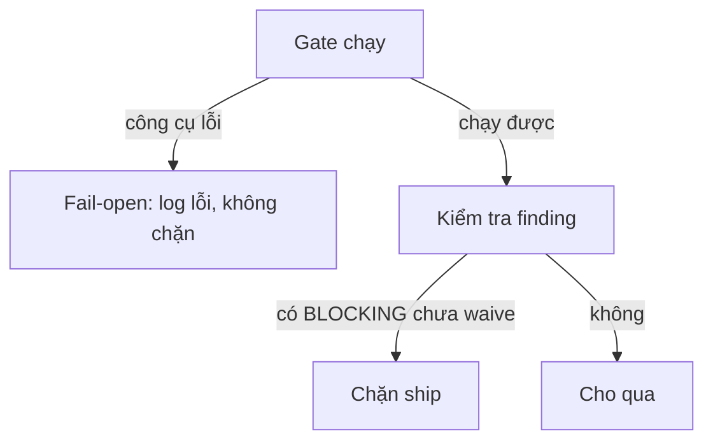
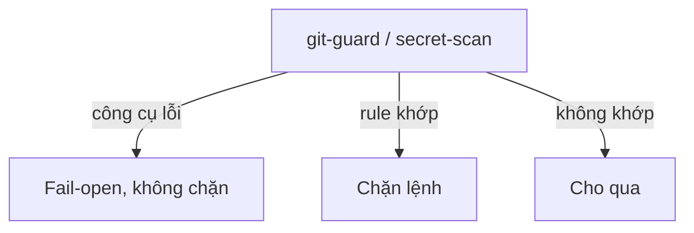

# Gate fail-open

## Tổng quan

Các gate trong kit (`analyze`, `standards`, `db-perf`, `docs sync`) chỉ đọc và trả finding, không tự sửa code. Khi chính gate gặp lỗi (DB không kết nối được, file diff hỏng, thiếu config), nó có hai lựa chọn: chặn việc ship, hoặc bỏ qua để việc tiếp tục.

Tất cả gate này chọn fail-open: lỗi công cụ không chặn. Lý do là chúng có vai trò advisory.

- `db-perf` — chạy mỗi khi diff chạm truy vấn DB: bắt buộc trong `znf:ground`, trong `znf:explain-plan` (do `cook` gọi) và khi `znf:ship`.
- `analyze` — trong `cook`, **trước khi implement**: soát spec và plan.
- `standards` — trong `cook`, **sau khi implement**: soát code so với spec.
- `docs sync` — mỗi lần mở và đóng session (hook `Stop`/`SessionStart`).

git-guard (PreToolUse hook trên mọi lệnh git) và secret-scan (trước commit/push) khác các gate trên ở phản ứng với một rule khớp, không ở phản ứng với lỗi công cụ. Lệnh git chạm branch deploy, hoặc staged diff có secret, thì chúng chặn lệnh. Khi chính công cụ gặp lỗi (ví dụ scanner không khởi tạo được), git-guard và secret-scan không chặn lệnh, giống các gate kia. Gọi chúng là "fail-closed" là không đúng.

## Cách hoạt động

*Gate advisory: lỗi công cụ không chặn, finding BLOCKING mới chặn*

*git-guard và secret-scan: rule khớp thì chặn, lỗi công cụ vẫn fail-open*

Hai nhóm đều fail-open khi công cụ hỏng, vì chặn lúc đó chỉ nghẽn việc mà không thêm an toàn. Khác biệt nằm ở trường hợp công cụ chạy được. `db-perf`, `analyze`, `standards` còn người review phía sau. git-guard và secret-scan là tuyến cuối: không ai bắt lại được commit đã vào branch deploy hay secret đã push.

## Liên quan

- [Knowledge store và view `docs/`](/concepts/knowledge-store): `docs sync` cũng fail-open theo nguyên tắc này.
- Tham chiếu lệnh: [`zenify db-perf`](/reference/cli/zenify_db-perf), [`zenify analyze`](/reference/cli/zenify_analyze).

## Lưu ý

Fail-open nghĩa là lỗi công cụ không chặn. Nó không có nghĩa một finding BLOCKING chưa xử lý được phép đi qua.

Một agent chạy gate rồi đi idle mà không phản hồi cũng không phải "gate sạch". Từ báo cáo, bạn không phân biệt được im lặng với kết quả sạch. Hãy hỏi lại đúng tên agent đó thay vì đọc im lặng thành kết quả tốt.

<!-- Nguồn (cho người bảo trì, không hiển thị):
- `docs/handoff/zenify-kit/m9-db-perf-gate.md` (fail-open tuyệt đối, hai tier BLOCKING/ADVISORY, cờ waive)
- `docs/handoff/zenify-kit/m4-review.md` (fail-open ở review engine, "im lặng ≠ sạch")
- mã nguồn git-guard trong repo kit (công cụ lỗi → không chặn; chặn chỉ khi rule khớp)
- `./zenify db-perf --help`, `./zenify analyze --help`
-->
