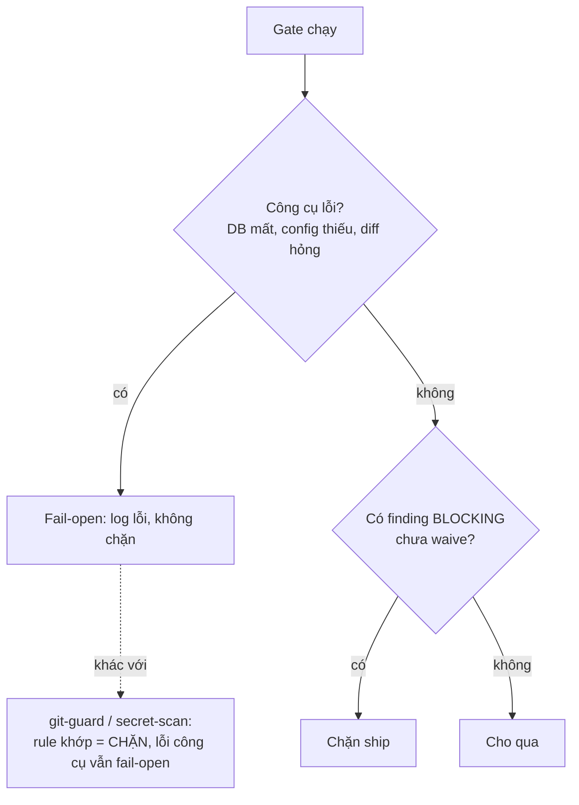

# Gate fail-open

## Vấn đề nó giải quyết

Một gate trong kit — `analyze`, `standards`, `db-perf`, `docs sync` — chỉ đọc và trả finding, chưa bao giờ tự sửa code. Câu hỏi còn lại là: khi bản thân gate gặp lỗi (DB không kết nối được, file diff hỏng, thiếu config), nó nên chặn việc ship lại, hay bỏ qua và để việc tiếp tục? Toàn bộ các gate này chọn **fail-open** — lỗi công cụ không chặn — vì mục đích của chúng là advisory: `db-perf` chạy ở `znf:ground` (mandatory), `znf:explain-plan` (bước 3 của `cook`) và bước 5 của `znf:ship`; `analyze` chạy ở bước 5b của `cook`, trước khi implement; `standards` ở bước 6b, sau khi implement; `docs sync` ở mọi hook `Stop`/`SessionStart`. git-guard (PreToolUse hook trên mọi lệnh git) và secret-scan (trước commit/push) khác ở phản ứng với một RULE KHỚP, không ở phản ứng với lỗi công cụ: lệnh git chạm nhánh deploy hoặc có secret trong staged diff thì chúng CHẶN cứng (deny, exit khác 0). Nhưng khi chính công cụ lỗi (panic, đọc stdin lỗi, scanner không khởi tạo được), git-guard cũng fail-open y hệt các gate kia — nên gọi chúng là "fail-closed" là sai chữ.

## Mô hình tư duy

Không nghịch lý: cả hai nhóm fail-open khi công cụ hỏng, vì chặn cứng lúc đó chỉ nghẽn việc mà không thêm an toàn thật. Khác biệt nằm ở nhánh còn lại — khi công cụ CHẠY ĐƯỢC: `db-perf`/`analyze`/`standards` còn người review phía sau; git-guard/secret-scan là tuyến cuối, không ai bắt lại commit đã lỡ vào nhánh deploy hay secret đã lỡ push.

## Ghép với …

- [Knowledge store và view `docs/`](/concepts/knowledge-store) — `docs sync` cũng fail-open cùng nguyên tắc này.
- Tham chiếu lệnh: [`zenify db-perf`](/reference/cli/zenify_db-perf), [`zenify analyze`](/reference/cli/zenify_analyze).

## Edge case

Fail-open nghĩa là lỗi công cụ không chặn, **không có nghĩa** một finding BLOCKING chưa xử lý được phép trôi qua. Một agent dispatch chạy gate rồi đi idle không phản hồi cũng không phải "gate sạch" — im lặng và sạch không phân biệt được từ báo cáo, nên phải hỏi lại tên agent đó, không đọc im lặng thành kết quả tốt.

## Nguồn

- `docs/handoff/zenify-kit/m9-db-perf-gate.md` (fail-open tuyệt đối, hai tier BLOCKING/ADVISORY, cờ waive)
- `docs/handoff/zenify-kit/m4-review.md` (M4b/M4f fail-open, "im lặng ≠ sạch")
- `internal/cli/gitguard.go` (`runGitGuard`: panic/stdin lỗi → exit 0; deny chỉ khi `d.Deny` từ rule khớp → exit 2)
- `./zenify db-perf --help`, `./zenify analyze --help`
- Ground trên binary build từ commit bf91c62 của nhánh này (2026-09-14), chưa phát hành.
