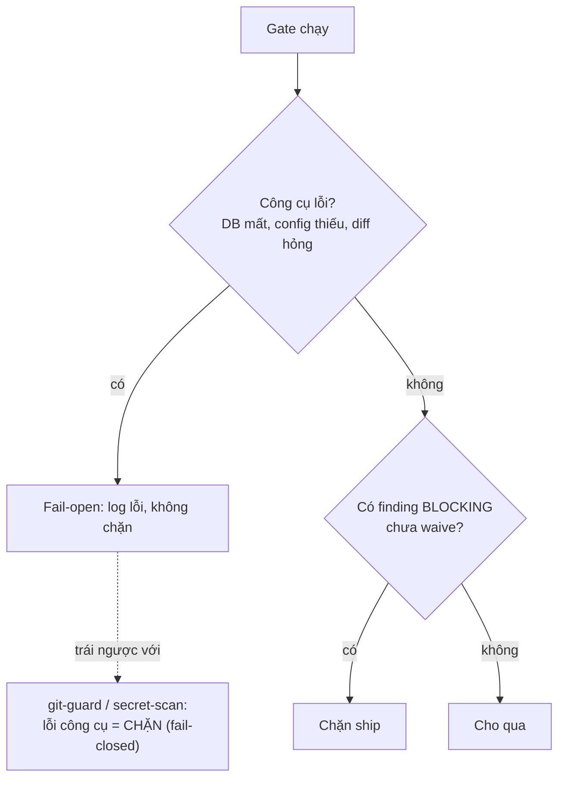

# Gate fail-open

## Vấn đề nó giải quyết

Một gate trong kit — `analyze`, `standards`, `db-perf`, `docs sync` — chỉ đọc và trả finding, chưa bao giờ tự sửa code. Câu hỏi còn lại là: khi bản thân gate gặp lỗi (DB không kết nối được, file diff hỏng, thiếu config), nó nên chặn việc ship lại, hay bỏ qua và để việc tiếp tục? Phần lớn gate trong kit chọn **fail-open** — lỗi công cụ không chặn — vì mục đích của chúng là advisory: `db-perf` chạy ở `znf:ground` (mandatory), `znf:explain-plan` (bước 3 của `cook`) và bước 5 của `znf:ship`; `analyze` chạy ở bước 5b của `cook`, trước khi implement; `standards` ở bước 6b, sau khi implement; `docs sync` ở mọi hook `Stop`/`SessionStart`. Hai cơ chế khác trong kit chọn ngược lại, **fail-closed** — git-guard (mọi lệnh git, PreToolUse hook) và secret-scan (trước commit/push) — vì hậu quả của việc bỏ qua chúng nghiêm trọng hơn nhiều so với hậu quả của việc chặn nhầm.

## Mô hình tư duy

Nghịch lý bề ngoài: một gate an toàn hơn (git-guard) lại chặn nhiều hơn khi lỗi, còn một gate về đúng đắn dữ liệu (`db-perf`) lại nhường đường khi lỗi. Điều đó đúng vì `db-perf`/`analyze`/`standards` vẫn còn một tầng người review phía sau — chặn cứng khi công cụ hỏng chỉ làm nghẽn việc mà không thêm an toàn thật; còn git-guard/secret-scan là tuyến cuối, không có ai đứng sau bắt lại một commit đã lỡ vào nhánh deploy hay một secret đã lỡ push.

## Ghép với …

- [Knowledge store và view `docs/`](/concepts/knowledge-store) — `docs sync` cũng fail-open cùng nguyên tắc này.
- Tham chiếu lệnh: [`zenify db-perf`](/reference/cli/zenify_db-perf), [`zenify analyze`](/reference/cli/zenify_analyze).

## Edge case

Fail-open có nghĩa lỗi công cụ không chặn, **không có nghĩa** một finding BLOCKING chưa xử lý được phép trôi qua — hai chuyện thuộc hai câu hỏi khác nhau. Và một agent được dispatch để chạy gate rồi đi idle không phản hồi không phải là "gate chạy sạch, không có finding" — im lặng và sạch là hai trạng thái không phân biệt được từ báo cáo, nên phải hỏi lại tên agent đó chứ không được đọc im lặng thành kết quả tốt.

## Nguồn

- `docs/handoff/zenify-kit/m9-db-perf-gate.md` (fail-open tuyệt đối, hai tier BLOCKING/ADVISORY, cờ waive)
- `docs/handoff/zenify-kit/m4-review.md` (M4b mechanical-gate/VERIFY fail-open, M4f advise-gate fail-open, "im lặng ≠ sạch" ở phần lỗi)
- `./zenify db-perf --help`, `./zenify analyze --help`
- Ground trên binary build từ commit bf91c62 của nhánh này (2026-09-14), chưa phát hành.
