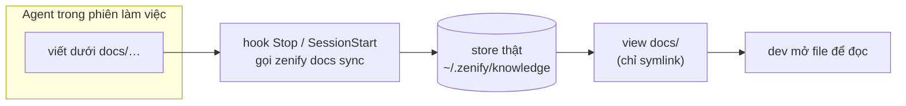

# Knowledge store và view `docs/`

## Vấn đề nó giải quyết

Spec, plan, handoff và release report là record của cả team, nhưng workspace root không phải một git repo — nên không ai `git pull` được chúng, và trước đây chúng chỉ nằm rải rác trên ổ đĩa của một người. Knowledge store là một git repo riêng, private, giữ toàn bộ record đó ở một nơi ai cũng đọc được, đồng bộ tự động, không ai phải tự tay merge hay clone.

## Mô hình tư duy

Store thật sống ở `~/.zenify/knowledge` (quy ước như `~/.npm`/`~/.m2` — ẩn ở home dir, không nằm trong workspace). `docs/` trong workspace chỉ là một **view gồm symlink** trỏ vào các thư mục nội dung không-dot của store: `specs/ plans/ handoff/ reference/ releases/`. Đọc/ghi qua `docs/specs/…` vẫn hoạt động bình thường vì xuyên qua symlink — cách viết spec/plan không đổi. **Agent là writer duy nhất**: mỗi lượt (hook `Stop`) và lúc mở phiên (`SessionStart`) đều gọi `zenify docs sync`, việc này commit, `pull --rebase`, rồi push `main` của store, fail-open (lỗi mạng không chặn phiên làm việc). Dev không bao giờ `git clone` hay chạy git trong store — chỉ mở file qua `docs/…` trong editor.

## Ghép với …

- [Ba lớp: binary, plugin, knowledge store](/concepts/three-layers) — knowledge store là lớp thứ ba.
- [Gate fail-open](/concepts/gate-fail-open) — `docs sync` cũng là một cơ chế fail-open, cùng họ với gate.

## Edge case

- **File tracked trong store là `chmod 0444`** trên máy người đọc — một guardrail cơ học chống sửa tay, không phải một cơ chế bảo mật.
- **Không bao giờ chạy git trực tiếp trong store** — không PR, không merge, không clone tay; toàn bộ vòng đời do `zenify docs sync` quản lý.
- **Máy chưa migrate** (chưa có `~/.zenify/knowledge`, chưa có `docs/` cũ) thì hàm resolve rơi về workspace `docs/` như bản cũ — vẫn hoạt động, chỉ chưa ở layout mới; máy hoàn toàn mới (không có gì tồn tại) thì tự clone thẳng vào `~/.zenify/knowledge`, tự nhận layout mới mà không cần bước migrate tay.

## Nguồn

- `docs/handoff/zenify-kit/docs-sync-layer.md` (resolve, view symlink, ba trạng thái máy, chmod 0444)
- `docs/handoff/zenify-kit/m6-team-knowledge.md` (M6a record layer, các subtree `specs/plans/handoff/reference/releases`)
- Ground trên binary build từ commit bf91c62 của nhánh này (2026-09-14), chưa phát hành.
