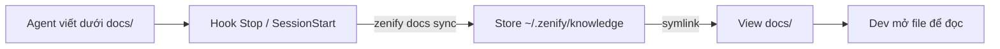

# Knowledge store và view `docs/`

## Tổng quan

Spec, plan, handoff và release report là record của cả team. Workspace root không phải một git repo, nên không ai `git pull` được chúng. Trước đây các file này nằm rải rác trên máy của một người.

Knowledge store là một git repo riêng, private, giữ toàn bộ record đó ở một nơi ai cũng đọc được. Store đồng bộ tự động. Không ai phải tự merge hay clone.

## Cách hoạt động

*Đường đi của một record từ agent đến người đọc*

Store thật nằm ở `~/.zenify/knowledge`, theo quy ước như `~/.npm` hay `~/.m2`: ẩn ở home dir, không nằm trong workspace. `docs/` trong workspace chỉ là một view gồm symlink trỏ vào các thư mục nội dung không-dot của store: `specs/ plans/ handoff/ reference/ releases/`. Đọc và ghi qua `docs/specs/...` vẫn hoạt động bình thường vì đi xuyên symlink. Cách viết spec/plan không đổi.

Agent là writer duy nhất. Mỗi lượt (hook `Stop`) và lúc mở phiên (`SessionStart`) đều gọi `zenify docs sync`. Lệnh này commit, `pull --rebase`, rồi push `main` của store. Lệnh fail-open: lỗi mạng không chặn phiên làm việc. Dev không `git clone` hay chạy git trong store. Dev chỉ mở file qua `docs/...` trong editor.

## Liên quan

- [Ba lớp: binary, plugin, knowledge store](/concepts/three-layers): knowledge store là lớp thứ ba.
- [Gate fail-open](/concepts/gate-fail-open): `docs sync` cũng fail-open theo cùng nguyên tắc với gate.

## Lưu ý

- File tracked trong store là `chmod 0444` trên máy người đọc. Đây là guardrail chống sửa tay, không phải cơ chế bảo mật.
- Không chạy git trực tiếp trong store: không PR, không merge, không clone tay. Toàn bộ vòng đời do `zenify docs sync` quản lý.
- Máy chưa migrate (chưa có `~/.zenify/knowledge`, chưa có `docs/` cũ): hàm resolve dùng workspace `docs/` như bản cũ. Vẫn hoạt động, chỉ chưa ở layout mới. Máy hoàn toàn mới: kit clone thẳng vào `~/.zenify/knowledge` và nhận layout mới, không cần migrate tay.

<!-- Nguồn (cho người bảo trì, không hiển thị):
- `docs/handoff/zenify-kit/docs-sync-layer.md` (resolve, view symlink, ba trạng thái máy, chmod 0444)
- `docs/handoff/zenify-kit/m6-team-knowledge.md` (record layer, các subtree `specs/plans/handoff/reference/releases`)
-->
