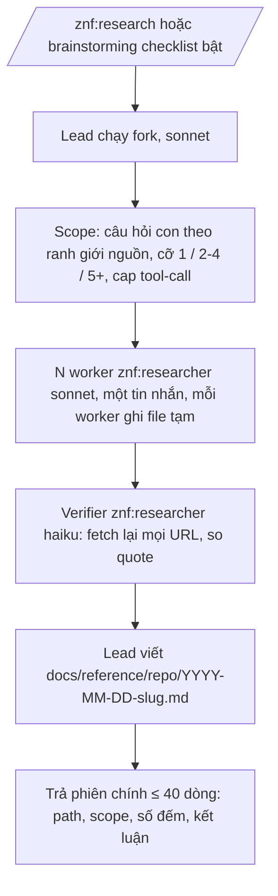

# Research có kiểm chứng: khi nào, luồng, chi phí

## Vì sao có skill riêng

Trong 30 ngày đo trên một workspace, agent research được dispatch 66 lần, lần nào cũng viết prompt tay, không lần nào có bước kiểm lại URL. Kết quả là claim ngoài codebase đi vào spec mà không ai fetch được nguồn, lỗi "nhớ chắc nhưng đã lỗi thời" không bị bắt, và báo cáo dài trả thẳng vào phiên chính rồi mất sau `/clear`.

`znf:research` chuẩn hoá ba điểm đó: hợp đồng output có quote nguyên văn và URL đã fetch, một lượt verify tách riêng, và kết quả là file trong knowledge store.

## Khi nào chạy — checklist năm mục

Brainstorming chạy checklist một lần sau khi hỏi làm rõ, trước khi đề xuất phương án. Một mục đúng là gọi research; không mục nào thì bỏ qua và không viết mục "prior art" cho có.

1. Thiết kế phụ thuộc thư viện / framework / tool / API ngoài mà session chưa đọc docs.
2. Thiết kế dựa vào "người khác làm X thế nào".
3. Có sự thật dễ lỗi thời: latest, version, giá, release note, sau knowledge cutoff.
4. Có từ hai phương án thật sự khác nhau mà chọn sai tốn hơn một lượt research (~5 USD).
5. Ngược lại: điều chưa biết nằm trong repo hoặc DB → `/znf:ground` hoặc `/znf:scout`, không research.

Số liệu đằng sau: 9 trong 88 spec của một team cần research, toàn bộ là việc thiết kế tool và quy trình. Feature sản phẩm hầu như không cần, nên đây là bước có điều kiện, không phải bước cố định.

## Luồng

Skill chạy `context: fork`, tức toàn bộ việc tìm-đọc nằm ngoài context phiên chính. Đổi lại nó không hỏi được bạn giữa chừng: khối scope (câu hỏi con, số worker, chi phí ước tính) được in ở đầu báo cáo và trong phần trả về; không đồng ý thì gọi lại với câu hỏi hẹp hơn.

## Đọc file kết quả

Bảng phát hiện có cột trạng thái verify. Chỉ hàng `VERIFIED` được dùng cho kết luận và cho spec. Hàng `QUOTE-MISMATCH` (trang có nhưng không thấy quote) hay `DEAD-URL` vẫn nằm trong bảng để bạn biết worker đã tìm gì, nhưng không được trích. Mục "Không tìm thấy" liệt kê từng khoảng trống kèm đã thử ở đâu — đưa vào spec như giả định đã nêu.

## Chi phí

Một worker sonnet khoảng 1,6 USD; verifier haiku dưới 1 USD. Research so sánh điển hình (3 worker + verifier) khoảng 5–6 USD. Bảng cỡ giữ số worker theo độ phức tạp, không mặc định 5. Đo lại bằng `zenify cost --by-skill` khi cần số chính xác.

## Không làm

Xuất PDF/HTML, persona phản biện, critique loop nhiều vòng, Agent Teams, commit kết quả vào repo đích. Knowledge store đã là nơi ghi.
