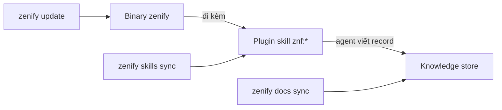

# Ba lớp: binary, plugin, knowledge store

## Tổng quan

ZenifyKit gồm ba phần tách biệt. Mỗi phần nằm ở một vị trí khác trên máy, cập nhật bằng lệnh khác và do một bên khác chịu trách nhiệm sửa.

Bạn cần phân biệt ba lớp này để sửa đúng chỗ. Ví dụ: nếu bạn sửa tay một skill trong `~/.claude/skills/znf`, bản sửa sẽ không nhận bản vá tiếp theo của kit. Trang này mô tả ba lớp, ai chịu trách nhiệm từng lớp và ranh giới giữa chúng.

## Cách hoạt động

| Lớp | Vị trí trên máy | Cập nhật bằng | Ai sửa |
|---|---|---|---|
| Binary `zenify` | trong `PATH` | `zenify update` | release của kit (tag + goreleaser) |
| Plugin skill `znf:*` | `~/.claude/skills/znf` | `zenify skills sync` (tự chạy trong `zenify up`) | PR vào repo kit. Nội dung skill đi kèm trong binary, không tải riêng |
| Knowledge store | `~/.zenify/knowledge` | hook `Stop`/`SessionStart` gọi `zenify docs sync` | agent, khi viết spec/plan/handoff/release trong phiên làm việc |

*Ba lớp và lệnh cập nhật của từng lớp*

Ba lớp không đồng bộ phiên bản với nhau. Binary có thể ở `v0.18.2` trong khi knowledge store vừa nhận một commit do agent viết một phút trước. Hai nhầm lẫn thường gặp khi mới dùng kit: coi plugin skill là thứ bạn tự viết, và coi knowledge store là một phần của binary.

## Liên quan

- [Namespace `znf:`](/concepts/znf-namespace): vì sao lớp plugin không ảnh hưởng skill cá nhân của bạn.
- [Knowledge store và view `docs/`](/concepts/knowledge-store): chi tiết lớp thứ ba và vì sao nó không nằm trong repo kit.
- [Cài đặt](/getting-started/install): nơi lớp binary được cài lần đầu.

## Lưu ý

`zenify skills sync` ghi cây `znf/` theo một manifest theo dõi từng file. Vì vậy lần chạy lại không đối xứng: file bạn chưa sửa được cập nhật lên bản mới nhất trong binary, file bạn đã sửa tay được giữ nguyên.

Hệ quả: sau khi sửa tay một file, bạn không còn nhận bản vá tiếp theo của file đó. Các cải tiến từ `zenify update` sẽ bỏ qua nó cho tới khi bạn xóa bản sửa tay hoặc đưa thay đổi vào repo kit qua PR. Nếu cần đổi hành vi một skill của kit lâu dài, hãy sửa ở repo kit, không sửa bản đã materialize trên máy.

<!-- Nguồn (cho người bảo trì, không hiển thị):
- `internal/plugin/assets/znf/skills/discipline/SKILL.md` (bố cục plugin)
- `docs/handoff/zenify-kit/m2-plugin-skills.md` (`zenify skills sync` additive và refresh-safe: cập nhật file chưa sửa tay, giữ nguyên file đã sửa tay)
- `docs/handoff/zenify-kit/docs-sync-layer.md` (lớp knowledge store, agent là writer duy nhất)
-->
