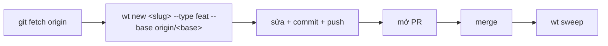

# Worktree theo slug

## Vấn đề nó giải quyết

Sửa code trực tiếp trên bản checkout chính là cách nhanh nhất để một bản dở dang chặn đường tác vụ khác, hoặc để hai phiên làm việc giẫm lên nhau trên cùng thư mục. `wt` cô lập mỗi tác vụ vào một worktree git riêng — branch, port, `.env` riêng — để bản checkout chính luôn sạch, chỉ dùng để đọc và giữ record. Câu hỏi đơn vị "slug" trả lời: một tác vụ gồm nhiều bước, nhiều lần sửa, có cần nhiều worktree không? Không — đúng một.

## Mô hình tư duy

Một **slug** đặt tên cho toàn bộ vòng đời này: nó trở thành tên branch `<user>/<type>/<slug>` và tên thư mục worktree. Một plan chia nhỏ thành nhiều SDD task (Task 1, Task 2, …), nhưng tất cả dùng chung một worktree — cấp thêm worktree cho mỗi task là phá vỡ đúng quy tắc "một repo, một worktree" mà slug tồn tại để giữ. Gọi `wt new` một lần nữa với cùng slug trong cùng phiên sẽ bị từ chối, kèm dòng `cd` tới worktree đã mở sẵn.

## Ghép với …

- [Base ref, hotfix base, port block](/concepts/base-ref-and-ports) — `--base` lấy từ đâu và vì sao hotfix khác.
- [Ba lớp: binary, plugin, knowledge store](/concepts/three-layers) — `wt` là một phần của lớp binary.
- Tham chiếu lệnh: [`zenify wt`](/reference/cli/zenify_wt), [`zenify wt new`](/reference/cli/zenify_wt_new).

## Edge case

- **`--another`** mở worktree thứ hai trong cùng repo — dành cho một yêu cầu thật sự tách biệt, không phải "việc này thấy hơi khác" (cách một slug biến thành nhiều branch trong một ngày).
- **Hotfix được miễn trừ tự động**: base ref khác (release mới nhất, không phải nhánh tích hợp), vì giữa chừng một tính năng vẫn có thể cần vá production ngay.
- **`wt rm <slug>`** từ chối xoá worktree chưa có dấu vết merge trừ khi thêm `--force` — an toàn để gọi thử mà không sợ mất việc chưa land.
- **`.worktrees/` phải nằm trong `.gitignore` đã commit**, không phải `.git/info/exclude` — khai báo cục bộ thì đồng nghiệp clone repo lần đầu thấy checkout của họ "bẩn" ngay khi chạy `wt new` lần đầu.

## Nguồn

- `internal/plugin/assets/znf/skills/discipline/SKILL.md` §8 (đơn vị slug, `--another`, miễn trừ hotfix, `wt rm` từ chối chưa merge)
- `docs/handoff/zenify-kit/m0-foundation.md` (`wt new`/`wt rm`/`wt sweep` — hành vi và cờ thật của build này)
- `./zenify wt --help` (danh sách subcommand: `config, ls, new, path, promote, rm, sweep, url, wire`)
- Ground trên binary build từ commit bf91c62 của nhánh này (2026-09-14), chưa phát hành.
