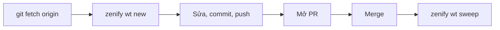

# Worktree theo slug

## Tổng quan

Sửa code trực tiếp trên checkout chính dễ gây hai vấn đề: một bản dở dang chặn tác vụ khác, và hai phiên làm việc ghi đè nhau trên cùng thư mục. `wt` cô lập mỗi tác vụ vào một worktree git riêng, với branch, port và `.env` riêng. Checkout chính luôn sạch và chỉ dùng để đọc hoặc giữ record.

Một tác vụ gồm nhiều bước và nhiều lần sửa vẫn chỉ dùng một worktree. Đơn vị của worktree là slug.

## Cách hoạt động



*Vòng đời một slug, từ tạo worktree đến dọn dẹp*

Lệnh tạo worktree đầy đủ:

```sh
git fetch origin
zenify wt new <slug> --type feat --base origin/<base>
```

Slug đặt tên cho toàn bộ vòng đời này. Nó trở thành tên branch `<user>/<type>/<slug>` và tên thư mục worktree.

Một plan chia thành nhiều SDD task (Task 1, Task 2, ...). Tất cả task đó dùng chung một worktree. Cấp thêm worktree cho từng task vi phạm quy tắc "một repo, một worktree" mà slug tồn tại để giữ. Gọi `zenify wt new` lần nữa với cùng slug trong cùng phiên sẽ bị từ chối, kèm dòng `cd` tới worktree đã mở.

## Liên quan

- [Base ref, hotfix base, port block](/concepts/base-ref-and-ports): `--base` lấy từ đâu và vì sao hotfix khác.
- [Ba lớp: binary, plugin, knowledge store](/concepts/three-layers): `wt` là một phần của lớp binary.
- Tham chiếu lệnh: [`zenify wt`](/reference/cli/zenify_wt), [`zenify wt new`](/reference/cli/zenify_wt_new).

## Lưu ý

- `--another` mở worktree thứ hai trong cùng repo. Dùng cho một yêu cầu thật sự tách biệt, không dùng khi chỉ thấy "việc này hơi khác". Lạm dụng cờ này là cách một slug thành nhiều branch trong một ngày.
- Hotfix được miễn quy tắc trên. Base ref của hotfix là release mới nhất, không phải branch tích hợp, vì production có thể cần sửa ngay giữa lúc bạn đang làm tính năng.
- `zenify wt rm <slug>` từ chối xóa worktree chưa có dấu vết merge, trừ khi thêm `--force`. Bạn có thể gọi thử mà không mất công việc chưa land.
- `.worktrees/` phải nằm trong `.gitignore` đã commit, không nằm trong `.git/info/exclude`. Khai báo cục bộ không đi theo repo, nên đồng nghiệp clone lần đầu sẽ thấy checkout bị bẩn ngay khi chạy `zenify wt new`.

<!-- Nguồn (cho người bảo trì, không hiển thị):
- `internal/plugin/assets/znf/skills/discipline/SKILL.md` §8 (đơn vị slug, `--another`, miễn trừ hotfix, `wt rm` từ chối chưa merge)
- `docs/handoff/zenify-kit/m0-foundation.md` (`wt new`/`wt rm`/`wt sweep`: hành vi và cờ thật của build này)
- `./zenify wt --help` (danh sách subcommand: `config, ls, new, path, promote, rm, sweep, url, wire`)
-->
