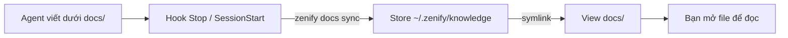

# Knowledge store và config team

Spec, plan, handoff và release report sống trong knowledge store, đồng bộ tự động qua `zenify docs sync`. Cấu hình chung của team đến workspace qua `zenify config`, một chiều từ store xuống.

## Khi nào dùng

Bạn hiếm khi gõ `zenify docs sync` tay. Hook `SessionStart` và `Stop` của Claude Code gọi lệnh này giúp bạn ở đầu và cuối mỗi lượt. Chạy tay khi bạn vừa tắt hook, hoặc muốn đẩy spec mới lên ngay.

Chạy `zenify config` khi team vừa đổi CLAUDE.md gốc, system map hoặc bộ rule chung. `zenify up` đã gọi lệnh này lúc onboard; bạn chỉ chạy tay khi muốn cập nhật giữa hai lần onboard.

Chạy `zenify rules lint` trước khi mở PR sửa rule team hoặc skill. Bước lint của `/znf:ship` đã chạy lệnh này cho bạn.

## Các bước



*Đường đi của một record từ agent đến người đọc*

Store thật nằm ở `~/.zenify/knowledge`, theo quy ước như `~/.npm` hay `~/.m2`. `docs/` trong workspace chỉ là view gồm symlink trỏ vào các thư mục nội dung của store: `specs/ plans/ handoff/ reference/ releases/`. Đọc và ghi qua `docs/specs/...` vẫn hoạt động bình thường vì đi xuyên symlink.

Agent là writer duy nhất. Bạn chỉ mở file qua `docs/...` trong editor để đọc, không `git clone`, không chạy git trong store. File tracked là `chmod 0444` trên máy bạn, một guardrail chống sửa tay chứ không phải cơ chế bảo mật.

## Lệnh

### `zenify docs sync`

| Cờ | Ý nghĩa |
|---|---|
| `--dir` | Đường dẫn store, khi không dùng `~/.zenify/knowledge`. |
| `--workspace` | Thư mục workspace để dựng view `docs/`. |

```bash
zenify docs sync
```

Lệnh kiểm tra trạng thái store trước: sạch thì không chạm mạng. Có thay đổi thì commit, `pull --rebase`, rồi push. Gặp conflict, lệnh hủy rebase và giữ commit cục bộ để lượt sau thử lại. Mọi lỗi mạng đều fail-open: lệnh in cảnh báo và thoát bình thường, không chặn phiên làm việc.

### `zenify config`

| Cờ | Ý nghĩa |
|---|---|
| `--apply` | Ghi file. Không có cờ này lệnh chỉ in diff. |
| `--config-dir` | Thư mục nguồn thay cho `.config/` trong store. |
| `--workspace` | Thư mục workspace đích. |

```bash
zenify config
zenify config --apply
```

Mặc định lệnh in từng file kèm trạng thái, đích và diff, rồi tóm tắt số file đổi, giữ nguyên và bỏ. Chiều đi luôn từ store vào workspace: sửa tay tại workspace sẽ bị ghi đè ở lần `--apply` sau, nên đổi cấu hình chung ở store.

### `zenify rules lint`

| Cờ | Ý nghĩa |
|---|---|
| `--include-go` | Quét cả mã nguồn Go của kit. |

```bash
zenify rules lint ~/.zenify/knowledge/.config/rules
```

Rule team phân phối tới mọi máy phải viết bằng tiếng Anh để agent đọc ổn định. Lệnh in từng dòng vi phạm theo file và số dòng, hoặc báo sạch khi không có. Dòng nằm trong code fence, inline code, hoặc mang marker `<!-- znf:allow-lang -->` (Markdown) hay `//znf:allow-lang` (mã nguồn) được bỏ qua. Không truyền tham số, lệnh quét asset skill đi kèm binary.

## Kết quả

| Artifact | Nội dung |
|---|---|
| `docs/specs, docs/plans, docs/handoff, docs/reference, docs/releases` | View symlink của store, đọc/ghi xuyên qua |
| `~/.zenify/knowledge` | Store thật, agent là writer duy nhất |
| File cấu hình workspace (CLAUDE.md gốc, system map, rules) | Ghi bởi `zenify config --apply` từ `.config/` của store |
| Kết quả `zenify rules lint` | Danh sách vi phạm `file:line`, hoặc thông báo sạch |

## Lưu ý

Không chạy git trực tiếp trong store: không PR, không merge, không clone tay. Toàn bộ vòng đời do `zenify docs sync` quản lý. `zenify config` chỉ một chiều store xuống workspace; đừng sửa file đích tay.

## Xem thêm

[`/reference/cli/zenify_docs_sync`](/reference/cli/zenify_docs_sync), [`/reference/cli/zenify_config`](/reference/cli/zenify_config), [`/reference/cli/zenify_rules_lint`](/reference/cli/zenify_rules_lint), [Knowledge store](/concepts/knowledge-store), [Gate fail-open](/concepts/gate-fail-open)

<!-- Nguồn (cho người bảo trì, không hiển thị):
- internal/docsgen/catalog/cli/zenify_docs.md, zenify_docs_sync.md, zenify_config.md, zenify_rules.md, zenify_rules_lint.md
- website/concepts/knowledge-store.md (mermaid, view symlink, chmod 0444)
- docs/handoff/zenify-kit/docs-sync-layer.md (resolve precedence, ba trạng thái máy)
- docs/handoff/zenify-kit/team-rule-system.md (langgate marker syntax, gate ở ship)
-->
