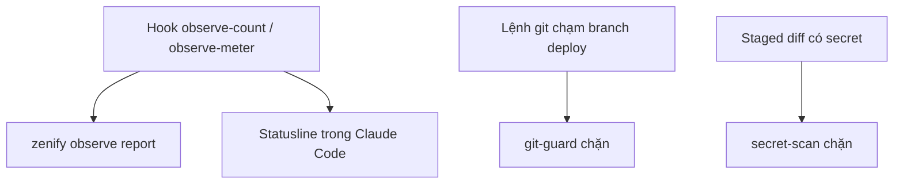

# Quan sát và an toàn

Kit theo dõi mức fan-out subagent và lượng tool output của mỗi phiên Claude Code, và chặn commit lộ secret hoặc chạm nhầm branch deploy. Ba mảng này chạy nền, bạn chỉ đọc kết quả hoặc xử lý khi bị chặn.

## Khi nào dùng

Xem `zenify observe report` khi bạn muốn biết một phiên đã fan-out bao nhiêu subagent và tiêu tốn bao nhiêu tool output. Cài statusline khi bạn muốn thấy các số đó ngay trong Claude Code thay vì chạy lệnh riêng.

Chạy `zenify secret-scan` trước khi push một branch có file cấu hình hoặc script mới. CI của mọi repo public đã chạy lệnh này cho bạn.

Chạy `zenify guard install` khi `zenify doctor` báo thiếu hook git-guard, hoặc sau khi bạn sửa tay `~/.claude/settings.json`.

## Các bước



*Quan sát số liệu phiên, và hai chốt chặn an toàn*

## Lệnh

### `zenify observe report`

| Cờ | Ý nghĩa |
|---|---|
| `--json` | In JSON thay cho bảng. |

```bash
zenify observe report
```

Kết quả là một bảng theo phiên, phiên hoạt động gần nhất hiện trước. Dữ liệu đến từ hai hook `observe-count` và `observe-meter` mà `zenify up` đã cài.

### `zenify observe statusline`

Claude Code gọi lệnh này qua key `statusLine` trong `~/.claude/settings.json`. Dòng statusline gồm các đoạn, ẩn khi trống: model, phần trăm ngữ cảnh, số dispatch subagent, lượng tool output và chi phí.

```bash
zenify observe statusline install
```

| Cờ | Ý nghĩa |
|---|---|
| `--segment` | Chỉ in hai đoạn của kit, số dispatch và tool output, để ghép vào statusline sẵn có. |
| `--force` (của `install`) | Đè statusline hiện có. |

Claude Code chỉ cho phép một statusline. Lệnh `install` chỉ ghi khi key `statusLine` còn trống; đã có statusline khác thì lệnh từ chối và gợi ý ghép đoạn bằng `--segment`, hoặc đè bằng `--force`.

### `zenify secret-scan`

```bash
zenify secret-scan .
```

Mỗi finding in ra một dòng gồm file, số dòng, tên rule và giá trị đã che, không in secret nguyên văn. Có finding thì lệnh kết thúc lỗi để CI đỏ. Không truyền đường dẫn, lệnh quét thư mục hiện tại.

### `zenify guard install`

```bash
zenify guard install
```

Lệnh đăng ký hook `PreToolUse` với matcher `Bash` trỏ tới `zenify git-guard`, và gỡ mục cũ nếu còn. Chạy lại khi đã có cấu hình, lệnh chỉ báo đã sẵn và không ghi gì. Danh sách branch deploy đọc từ `.claude/deploy-branches` của từng repo.

## Kết quả

| Artifact | Nội dung |
|---|---|
| Bảng hoặc JSON của `observe report` | Số dispatch subagent và tool output theo phiên |
| Đoạn statusline | Model, % ngữ cảnh, dispatch, tool output, chi phí |
| Output `secret-scan` | Danh sách finding `file:line:rule`, giá trị che |
| Hook git-guard | Chặn commit, push, merge vào branch trong `.claude/deploy-branches` |

## Lưu ý

Một binary vừa build nằm trong cây thư mục có thể tạo finding giả cho `secret-scan`. Xóa binary trước khi quét. Khi git-guard chặn một lệnh, hãy báo lại thay vì tìm cách vòng qua.

Git-guard và secret-scan chặn khi rule khớp, không phải advisory. Cách chúng phản ứng khi chính công cụ gặp lỗi xem ở [Gate fail-open](/concepts/gate-fail-open).

## Xem thêm

[`/reference/cli/zenify_observe_report`](/reference/cli/zenify_observe_report), [`/reference/cli/zenify_observe_statusline_install`](/reference/cli/zenify_observe_statusline_install), [`/reference/cli/zenify_secret-scan`](/reference/cli/zenify_secret-scan), [`/reference/cli/zenify_guard_install`](/reference/cli/zenify_guard_install), [Gate fail-open](/concepts/gate-fail-open)

<!-- Nguồn (cho người bảo trì, không hiển thị):
- internal/docsgen/catalog/cli/zenify_observe.md, zenify_observe_report.md, zenify_observe_statusline.md, zenify_observe_statusline_install.md, zenify_secret-scan.md, zenify_guard.md, zenify_guard_install.md
- website/concepts/gate-fail-open.md (git-guard/secret-scan phản ứng rule khớp, không phải lỗi công cụ)
-->
