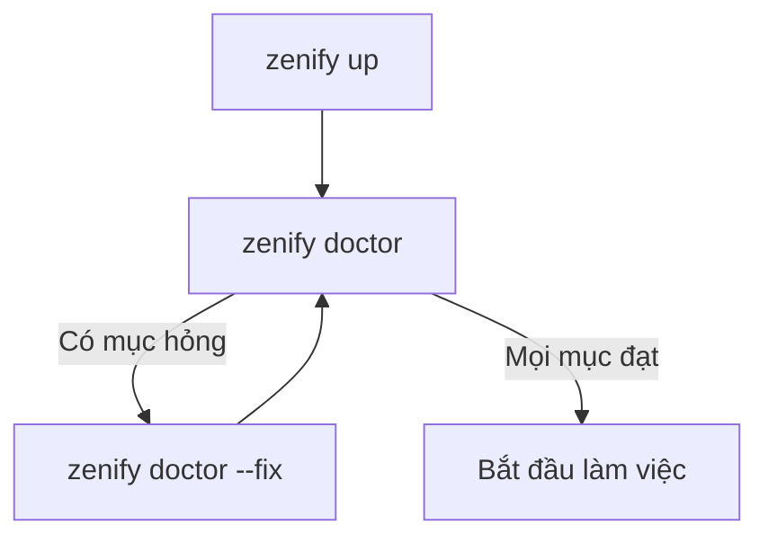

# Onboard workspace và repo

Trang này gom lại các lệnh dùng khi đưa một máy mới vào workspace, hoặc khi sửa lại layout repo trên một workspace đã có. Với luồng đầy đủ từng bước, đọc [Bắt đầu nhanh](/getting-started/quickstart) trước.

## Khi nào dùng

Dùng các lệnh ở đây khi cài ZenifyKit trên một máy mới, khi team thêm repo và bạn cần kéo về đúng bộ, khi cần kiểm tra môi trường đang thiếu gì, hoặc khi một workspace cũ có repo nằm rải ở gốc và cần chuyển sang layout `repos/<tên>`.

## Các bước



*Trình tự onboard một máy mới*

`zenify up` chạy an toàn nhiều lần: mỗi lần chạy lại nó chỉ sửa những gì lệch so với cấu hình chung của team, không ghi đè việc bạn đã tự chỉnh.

## Lệnh

### `zenify up`

Onboard máy vào workspace. Chạy trong terminal, lệnh mở wizard: chọn thư mục workspace, chọn repo bạn có quyền truy cập, rồi nhập secret cần cho verify UI và đọc DB.

Khi apply, lệnh clone repo còn thiếu, ghi các file cấu hình do kit sở hữu, gắn hook `znf` vào `~/.claude/settings.json`, đồng bộ plugin skill, chuẩn bị Playwright nếu workspace có repo frontend, clone knowledge store và ghi con trỏ workspace vào `~/.zenify/workspace`. Lệnh cần `gh` đã đăng nhập với scope `read:org` và `repo`.

```bash
zenify up
zenify up --non-interactive --dry-run --workspace ~/WorkingSpace/zenify
zenify up --non-interactive --apply --workspace ~/WorkingSpace/zenify
```

| Cờ | Ý nghĩa |
|---|---|
| `--apply` | Thực thi kế hoạch. Không kèm cờ này và không ở terminal, lệnh chỉ in kế hoạch |
| `--dry-run` | Chỉ in kế hoạch, không đổi gì. Mặc định khi chạy ngoài terminal |
| `--non-interactive` | Không mở wizard kể cả khi đang ở terminal. Dùng trong script |
| `--workspace` | Thư mục workspace |

### `zenify down`

Gỡ phần ZenifyKit đã cài vào máy và repo, giữ nguyên code, workspace và knowledge store. Đây là bước đảo của `zenify up`. Mặc định chỉ in preview, thêm `--apply` để thực thi. Lệnh không đụng vào repo đã clone hay knowledge store.

```bash
zenify down
zenify down --apply
```

### `zenify doctor`

Kiểm tra sức khỏe môi trường và báo từng mục đạt hay hỏng: phiên bản binary, đăng nhập git và quyền GitHub, secret trong `settings.local.json`, tool bên ngoài (`git`, `gh`, `mongosh`, `mysql`), Playwright, Docker và plugin skill `znf`. Chạy ngay sau `zenify up`, và mỗi khi một skill báo thiếu tool hoặc thiếu secret. Lệnh chỉ đọc, chạy bao nhiêu lần cũng được.

```bash
zenify doctor
zenify doctor --fix
```

| Cờ | Ý nghĩa |
|---|---|
| `--fix` | Tự sửa các mục an toàn rồi kiểm tra lại. Mục cần bạn tự làm vẫn in hướng dẫn |
| `--exit-on-fail` | Trả mã thoát khác 0 khi có mục hỏng, dùng trong script và CI |
| `--json` | In kết quả dạng JSON |

### `zenify migrate`

Gom các repo đang nằm rải ở gốc workspace vào thư mục con `repos/<tên>`, layout mà `zenify up` dùng. Chạy một lần khi workspace cũ chưa theo layout này.

```bash
zenify migrate
zenify migrate --apply
```

Mặc định lệnh chỉ liệt kê từng repo với hành động `Move`, `Refuse` hoặc `Skip` kèm lý do. Với `--apply`, lệnh di chuyển repo, sửa lại liên kết worktree, trỏ lại symlink `node_modules` và cập nhật đường dẫn trong manifest workspace, rồi nhắc bạn khởi động lại dev server đang chạy. Repo còn thay đổi chưa commit hoặc có worktree đang mở bị đánh `Refuse`.

### `zenify update`

Nâng cấp binary lên bản mới nhất bằng đúng kênh đã cài (Homebrew, Scoop, hoặc script cài đặt), hoặc chỉ kiểm tra có bản mới với `--check`. Đầu mỗi phiên, binary tự in dòng `zenify: vX is available` khi có bản mới; đặt `ZENIFY_NO_UPDATE_CHECK=1` để tắt dòng nhắc này.

```bash
zenify update --check
zenify update
```

## Cấu hình worktree của một repo

Mỗi repo tham gia workspace khai báo một file `.claude/worktree.json`, ví dụ của `zenify-kit`:

```json
{
  "abbrev": "kit",
  "baseRef": "origin/main",
  "worktreeDir": ".worktrees/",
  "copy": [".claude/settings.local.json"],
  "deps": "none",
  "portEnv": "PORT",
  "portRange": [3750, 3799]
}
```

| Trường | Ý nghĩa |
|---|---|
| `abbrev` | tên viết tắt của repo |
| `baseRef` | branch gốc mặc định cho `zenify wt new --type feat/fix` |
| `hotfixBaseRef` | base ref riêng cho `--type hotfix`, nếu khác `baseRef` |
| `worktreeDir` | thư mục chứa các worktree, thường `.worktrees/` |
| `copy` | các file được seed từ checkout chính vào worktree mới, ví dụ `.claude/settings.local.json` và `CLAUDE.md`. Nhờ seed `.claude/settings.local.json`, worktree dùng chung secret và bộ nhớ với checkout chính, xem [Secret và settings.local.json](/guides/read-real-data#secret-va-settings-local-json) |
| `deps` | cách seed dependency: `symlink`, `clone`, hoặc `none` cho repo không phải Node |
| `install` | lệnh cài dependency khi `deps` cần cài riêng |
| `portEnv` | tên biến môi trường worktree đọc port từ đó |
| `portRange` | khối port riêng của repo, không trùng repo khác trong workspace |

Chi tiết cách chọn `baseRef`, `hotfixBaseRef` và dải port cho repo mới: [Base ref và port block](/concepts/base-ref-and-ports).

## Kết quả

`.worktrees/` phải nằm trong `.gitignore` đã commit của mỗi repo, không nằm trong `.git/info/exclude`. Khai báo cục bộ không đi theo repo, nên đồng nghiệp clone lần đầu sẽ thấy checkout bị bẩn ngay khi chạy `zenify wt new`.

## Lưu ý

- `zenify up` chạy lại được bất cứ lúc nào, kể cả sau khi team thêm repo mới.
- Repo không phải Node vẫn onboard bình thường, chỉ cần `.claude/worktree.json` khai `"deps": "none"` và một khối port riêng.

## Xem thêm

[`zenify up`](/reference/cli/zenify_up), [`zenify doctor`](/reference/cli/zenify_doctor), [`zenify migrate`](/reference/cli/zenify_migrate), [`zenify down`](/reference/cli/zenify_down), [`zenify update`](/reference/cli/zenify_update), [Bắt đầu nhanh](/getting-started/quickstart), [Base ref và port block](/concepts/base-ref-and-ports)

<!-- Nguồn (cho người bảo trì, không hiển thị):
- reference/cli/zenify_up.md, zenify_down.md, zenify_doctor.md, zenify_migrate.md, zenify_update.md (generated)
- concepts/base-ref-and-ports.md (worktree.json field example và ý nghĩa)
-->
