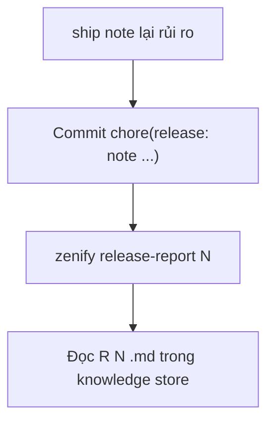

# Release và báo cáo

`zenify release-note` ghi metadata rủi ro cho từng thay đổi khi ship. `zenify release-report` gom các ghi chú đó thành một báo cáo rủi ro cho cả release, đọc thẳng từ git.

## Khi nào dùng

Bạn hiếm khi gõ `zenify release-note` tay. `/znf:ship` gọi lệnh này ở bước cuối, trước khi push branch, lấy giá trị từ ba tag rủi ro trong Brief của spec. Bạn chỉ chạy tay khi ship không có spec để lấy giá trị, hoặc khi đi đường không dùng workflow.

Chạy `zenify release-report` trước khi deploy một release, hoặc bất kỳ lúc nào bạn muốn xem release đang hình thành gồm những thay đổi gì.

## Các bước



*Từ một lần ship đến báo cáo release*

## Lệnh

### `zenify release-note`

| Cờ | Ý nghĩa |
|---|---|
| `--slug` | Slug của thay đổi. Bắt buộc. |
| `--note` | Mô tả một dòng. |
| `--blast` | Phạm vi ảnh hưởng. Mặc định `unknown`. |
| `--db` | Thay đổi DB. Mặc định `N/A`. |
| `--rollback` | Cách rollback. Mặc định `revert PR`. |
| `--spec` | Đường dẫn spec, tùy chọn. |
| `--dir` | Thư mục repo. Mặc định thư mục hiện tại. |

```bash
zenify release-note --slug kit-docs-site --note "Site tài liệu VitePress" \
  --blast "zenify-kit" --db "N/A" --rollback "revert PR"
```

Thiếu `--slug` thì lệnh bỏ qua và không chặn ship. Commit lỗi cũng không chặn ship.

### `zenify release-report`

| Cờ | Ý nghĩa |
|---|---|
| `--unreleased` | Ghi bản xem trước của release đang hình thành, từ release mới nhất tới `staging`, ra `unreleased.md`. |
| `--out-dir` | Thư mục ghi báo cáo. Mặc định thư mục releases của knowledge store. |
| `--workspace` | Thư mục workspace. Mặc định thư mục hiện tại. |
| `--no-fetch` | Không fetch, dùng ref local. |
| `--verbose` | Hiện cả commit chore và chi tiết từng commit. |

```bash
zenify release-report 42
zenify release-report --unreleased
```

Không truyền số release, lệnh tự lấy số lớn nhất tìm thấy trong các repo. Không tìm được số nào, lệnh báo và kết thúc bình thường, không lỗi.

## Kết quả

| Artifact | Nội dung |
|---|---|
| Commit `chore(release): note <slug>` | Trailer gồm slug, mô tả, blast radius, DB, cách rollback, đường dẫn spec nếu có |
| `R<N>.md` | Báo cáo release, ghi vào thư mục releases của knowledge store |
| `unreleased.md` | Bản xem trước release đang hình thành, khi dùng `--unreleased` |

Mỗi dòng trong báo cáo lấy metadata từ commit ghi chú của `zenify release-note`. Thay đổi có trong release nhưng chưa có trên `staging` được đánh dấu là regression, để bạn biết một hotfix chưa sync ngược.

## Lưu ý

`zenify release-report` chỉ đọc git, không tự sửa gì và không chặn deploy. Đây là artifact để bạn tự quyết định release có an toàn hay không.

## Xem thêm

[`/reference/cli/zenify_release-note`](/reference/cli/zenify_release-note), [`/reference/cli/zenify_release-report`](/reference/cli/zenify_release-report), [ship: verify và mở PR](/workflows/ship)

<!-- Nguồn (cho người bảo trì, không hiển thị):
- internal/docsgen/catalog/cli/zenify_release-note.md, zenify_release-report.md
- docs/handoff/zenify-kit/m7-release-report.md (regression definition, N auto-detect, fail-open)
-->
