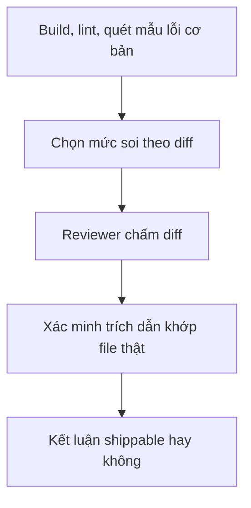

# Review và gate

Trang này gom ba lớp kiểm tra chạy quanh một thay đổi: review code, contract gate khi chạm tài nguyên chung, và gate hiệu năng DB. Cả ba đều chạy trong bước cuối của [`/znf:ship`](/workflows/ship).

## Khi nào dùng

Dùng `/znf:review` khi muốn review một diff độc lập, dùng `/znf:gate` ngay sau khi sửa một collection, kênh pub/sub, endpoint hoặc queue dùng chung, và để `/znf:ship` tự gọi cả `/znf:explain-plan` khi diff chạm một query DB. Phần lớn thời gian bạn không gọi các skill này bằng tay, chúng chạy như một phần của `/znf:ship`.

## Các bước



*Các bước của một lượt review*

## Lệnh

### `/znf:review`

Engine review hợp nhất của kit. Trước khi dispatch reviewer, skill chạy build/lint và một lượt quét lỗi mẫu cơ bản, không tốn ngân sách nếu bước này đã fail. Sau đó skill đo diff để chọn mức độ soi:

| Kích thước diff | Mức soi |
|---|---|
| Nhỏ | Một reviewer độc lập |
| Vừa | Năm reviewer chạy song song, mỗi người phụ trách một khía cạnh: lỗi, bảo mật, hiệu năng, hợp đồng, kiểu dữ liệu |
| Lớn, hoặc chạm vùng nhạy cảm (auth, tenant, migration) | Một vòng review đối kháng, phát hiện nghiêm trọng phải được nhiều reviewer độc lập xác nhận mới giữ lại |

Diff chạm hợp đồng chung (một collection, endpoint, queue, hoặc kênh pub/sub) được nâng mức soi tối thiểu lên mức vừa, kể cả khi diff nhỏ.

Mọi phát hiện có kèm vị trí file phải trích đúng dòng code thật. Skill xác minh cơ học từng trích dẫn đó khớp với file thật và loại bỏ phát hiện nào trích sai, trước khi kết luận có ship được hay không. Diff rất lớn được tách thành nhiều cụm file nhỏ hơn, mỗi cụm review riêng rồi gộp kết quả; nếu vẫn quá lớn để tách, skill dừng và đề nghị chia nhỏ pull request.

```text
/znf:review
```

Không có diff nào để review, skill báo "nothing to review" và dừng, không dispatch reviewer nào.

### `zenify review-log`

Xem tổng hợp các lần review đã ghi lại trên máy bạn: số lần review theo mức soi, số finding theo mức độ, tỷ lệ finding bị bác bỏ, số lần shippable, và các nhóm finding gặp nhiều nhất. Dữ liệu nằm trong checkout chính, nên chạy từ worktree vẫn thấy cùng một log.

```bash
zenify review-log
```

### `/znf:gate`

Cổng kiểm hợp đồng chung giữa các repo, chạy ngay sau khi sửa một collection/bảng dùng chung, một kênh pub/sub, một endpoint giữa các dịch vụ, hoặc một queue. Chỉ đọc, an toàn để chạy tự do.

```text
/znf:gate
/znf:gate chat_rooms
```

Skill lấy danh sách repo thực sự tham gia hợp đồng chung từ cấu hình workspace, tìm nơi khai báo tài nguyên, mọi nơi đọc/ghi qua lớp truy cập của repo đó, và mọi nơi truy cập trực tiếp bỏ qua lớp đó. Với tài nguyên là DB, skill xác minh tên collection/bảng và tên field bằng dữ liệu thật. Kết quả in ra thứ tự triển khai an toàn khi thay đổi phá vỡ hợp đồng.

### `zenify gate participants`

Liệt kê các repo tham gia contract gate cùng cách mỗi repo truy cập DB chung. Danh sách gộp từ file `gate-participants.json` trong knowledge store và các repo khai `gate.sharedStore=true` trong `.claude/worktree.json`.

```bash
zenify gate participants --workspace ~/WorkingSpace/zenify
```

### `/znf:contract-sweep`

Bước leo thang từ `/znf:gate`, quét sâu hơn khi một lượt quét inline không đủ tin: quá nhiều chỗ dùng để đánh giá chung, thay đổi chạm nhiều tài nguyên cùng lúc, hoặc gate báo sạch mà bạn vẫn nghi. Skill chạy mỗi repo một agent, tìm mọi chỗ dùng qua ba lượt (nơi định nghĩa, nơi dùng qua model symbol hoặc registry, nơi gọi raw driver và pipeline stage), rồi phán BREAKING, RISKY hoặc SAFE cho từng chỗ dùng.

```text
/znf:contract-sweep
```

Agent không tự chạy skill này, bạn phải tự gõ lệnh khi thấy cần.

### `/znf:explain-plan` và `zenify db-perf`

Gate hiệu năng DB, hai tầng. `/znf:ground` gọi skill này sớm ở mức advisory khi diff thêm một query; `/znf:ship` gọi lại ở bước verify, và một phát hiện BLOCKING chưa waive làm ship không hoàn tất.

```text
/znf:explain-plan
```

```bash
zenify db-perf --from origin/staging --to HEAD
```

Lệnh `zenify db-perf` quét tĩnh diff, không cần kết nối DB, và in từng finding kèm file, dòng, collection và gợi ý sửa. Khi DB truy cập được, skill chạy thêm explain plan thật cho từng query. Một `COLLSCAN` trên collection lớn, hoặc tỉ lệ document xem trên trả về quá cao, là BLOCKING; một `SORT` dù đã có index, hay `$lookup` sang collection bị quét toàn bộ, là ADVISORY.

Để waive một finding, thêm chú thích ngay trên dòng query:

```js
// znf:db-perf-ok: bảng chưa đủ lớn để cần index, đã đo thời gian thực tế
```

Finding chuyển sang WAIVED và lý do được ghi lại. Một collection chưa được phân loại tenant hay global tạo ra finding BLOCKING cho tới khi bạn thêm nó vào file phân loại của knowledge store.

## Kết quả

| Skill/lệnh | Kết quả |
|---|---|
| `/znf:review` | Danh sách finding xếp theo mức độ nghiêm trọng, kèm câu trả lời có ship được hay không |
| `/znf:gate` | Bảng usage theo repo, kèm nhận định phá vỡ hay không và thứ tự deploy an toàn |
| `/znf:contract-sweep` | Verdict BREAKING/RISKY/SAFE cho từng chỗ dùng, cùng các thay đổi cần có trước khi deploy |
| `zenify db-perf` | Finding BLOCKING hoặc ADVISORY kèm gợi ý sửa, hoặc "gate pass" nếu diff không có query |

## Lưu ý

- `/znf:gate` và `/znf:contract-sweep` dùng cùng danh sách repo và cùng ba lượt tìm, nên hai công cụ không được cho kết quả lệch nhau.
- Khi không đọc được diff, không kết nối được DB, hoặc không có `zenify` trong PATH, các gate này bỏ qua và không chặn phiên làm việc. Xem [Gate fail-open](/concepts/gate-fail-open) để hiểu nguyên tắc đó.
- Merge PR luôn là quyết định của bạn. Review sạch hay CI xanh không thay thế bước verify hành vi trong board của `/znf:ship`.

## Xem thêm

[`/reference/skills/review`](/reference/skills/review), [`/reference/skills/gate`](/reference/skills/gate), [`/reference/skills/contract-sweep`](/reference/skills/contract-sweep), [`/reference/skills/explain-plan`](/reference/skills/explain-plan), [`zenify db-perf`](/reference/cli/zenify_db-perf), [`zenify review-log`](/reference/cli/zenify_review-log), [ship: verify và mở PR](/workflows/ship), [Gate fail-open](/concepts/gate-fail-open)

<!-- Nguồn (cho người bảo trì, không hiển thị):
- reference/skills/review.md, gate.md, contract-sweep.md, explain-plan.md, ground.md (generated)
- reference/cli/zenify_db-perf.md, zenify_gate.md, zenify_gate_participants.md, zenify_review-log.md (generated)
- workflows/ship.md (bước 3 và 5, board)
-->
