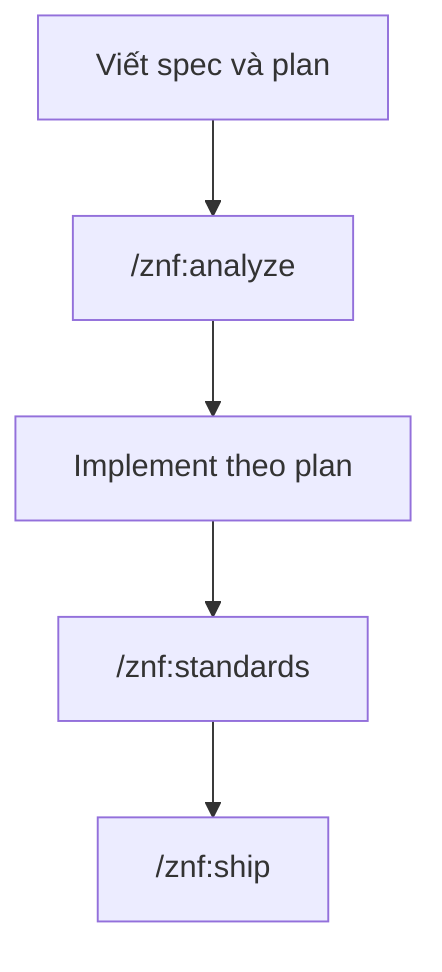

# Spec, plan và kiểm tra

Spec và plan là record của một tính năng, sống trong knowledge store. Trang này gom các lệnh soi vòng đời spec và hai bước kiểm tra chạy quanh cặp spec/plan đó.

## Khi nào dùng

Dùng `zenify spec status` khi muốn biết spec nào đã ship, spec nào còn đang làm. Dùng `zenify spec contracts` trước khi sửa một collection chung, để xem spec nào đã khai chạm vào nó. Dùng `/znf:analyze` sau khi viết xong spec và plan, trước khi giao cho implementer. Dùng `/znf:standards` sau khi implement xong plan, trước khi ship.

## Các bước



*Vị trí của hai bước kiểm tra quanh một plan*

## Lệnh

### `zenify spec status`

Liệt kê trạng thái vòng đời của từng spec trong knowledge store, một dòng mỗi spec gồm trạng thái, slug và đường dẫn.

```bash
zenify spec status --active
```

| Trạng thái | Nghĩa |
|---|---|
| `planned` | Có spec, chưa có plan |
| `in-progress` | Có plan, chưa có thay đổi nào ship |
| `built` | Một commit ghi chú release hoặc trailer `Spec:` trỏ về spec |
| `built?` | Chỉ khớp theo slug, chưa chắc chắn |
| `superseded` | Một spec khác khai `_Supersedes:` trỏ về spec này |
| `unknown` | Không đánh giá được qua git |

Cờ `--active` ẩn spec đã superseded. Cờ `--base` đổi ref cơ sở dùng chung cho mọi repo, mặc định lấy `baseRef` của từng repo. Cờ `--no-fetch` dùng ref local, không fetch.

### `zenify spec contracts`

Liệt kê repo và collection mà từng spec khai qua hai tag `_Blast-radius:` và `_DB:` trong Brief. Spec thiếu hai tag này được đếm và bỏ qua.

```bash
zenify spec contracts --collection chat_rooms
```

| Cờ | Ý nghĩa |
|---|---|
| `--repo` | Chỉ hiện spec khai repo này trong `_Blast-radius:` |
| `--collection` | Chỉ hiện spec khai collection này trong `_DB:` |

### `/znf:analyze`

Kiểm tra một cặp spec và plan trước khi code, mang tính tư vấn, không bao giờ chặn tiến độ. `/znf:cook` gọi skill này sau khi spec và plan viết xong, trước khi implement; bạn cũng gọi tay được trên bất kỳ cặp spec/plan nào.

```text
/znf:analyze docs/specs/contact-center-be/2026-09-14-ticket-tags-design.md docs/plans/contact-center-be/2026-09-14-ticket-tags.md
```

Phần cơ học (`zenify analyze`) kiểm: FR nào không có task nào phủ, task nào không khai `_Requirements:`, plan trích FR không có trong spec, marker `[NEEDS CLARIFICATION` còn sót, Brief có đủ 8 field không, và ba tag rủi ro `_Blast-radius:`, `_DB:`, `_Rollback:` có mặt không. Phần phán đoán thêm của skill xét: tiêu chí thành công có kiểm được không, Brief có giải thích vì sao đường hiện có không đủ, khối DB guarantees có thật hay chỉ ghi chung chung, và ba tag rủi ro có nội dung thật không. Báo cáo mở đầu bằng câu nhắc đây là tư vấn, không chặn.

### `/znf:standards`

Kiểm sau khi implement xong một plan, xem mỗi yêu cầu có test thật hay không. `/znf:cook` gọi skill này tự động ở bước cuối trước ship, cũng gọi tay được.

```text
/znf:standards docs/specs/contact-center-be/2026-09-14-ticket-tags-design.md docs/plans/contact-center-be/2026-09-14-ticket-tags.md
```

Skill đối chiếu từng yêu cầu trong spec với task trong plan và với file test thực tế trên đĩa: yêu cầu có task nhưng task không khai test, đường dẫn test khai trong plan không tồn tại, hoặc file test tồn tại nhưng rỗng. Sau đó skill tự đọc một vài file test không bị gắn cờ, xem test đó có thật sự khẳng định điều yêu cầu đòi hỏi hay chỉ là một khẳng định trống rỗng, và đối chiếu từng nhánh điều kiện trong tiêu chí thành công với assertion tương ứng.

## Kết quả

| Lệnh/skill | Kết quả |
|---|---|
| `zenify spec status` | Bảng trạng thái từng spec |
| `zenify spec contracts` | Bảng repo/collection từng spec khai chạm vào |
| `/znf:analyze` | Danh sách finding CRITICAL, HIGH, MEDIUM, mở đầu bằng "Advisory — does not block progress" |
| `/znf:standards` | Danh sách finding HIGH, MEDIUM, INFO kèm lý do |

## Lưu ý

- Ba tag `_Blast-radius:`, `_DB:`, `_Rollback:` trong Brief của spec là nguồn cho `zenify spec contracts` và cho phần kiểm cơ học của `/znf:analyze`. Thiếu tag nào, spec đó bị bỏ qua khi liệt kê contract.
- `zenify analyze` và `zenify standards` đều fail-open: thiếu spec, thiếu plan, hoặc không đọc được file, lệnh in lý do và kết thúc bình thường thay vì báo lỗi chặn.
- Cả `/znf:analyze` lẫn `/znf:standards` chỉ tư vấn. Bạn hoặc `/znf:cook` quyết định có sửa spec/plan hay đi tiếp.

## Xem thêm

[`zenify spec status`](/reference/cli/zenify_spec_status), [`zenify spec contracts`](/reference/cli/zenify_spec_contracts), [`zenify analyze`](/reference/cli/zenify_analyze), [`zenify standards`](/reference/cli/zenify_standards), [`/reference/skills/analyze`](/reference/skills/analyze), [`/reference/skills/standards`](/reference/skills/standards), [Knowledge store](/concepts/knowledge-store)

<!-- Nguồn (cho người bảo trì, không hiển thị):
- reference/cli/zenify_spec.md, zenify_spec_status.md, zenify_spec_contracts.md, zenify_analyze.md, zenify_standards.md (generated)
- reference/skills/analyze.md, standards.md (generated)
-->
