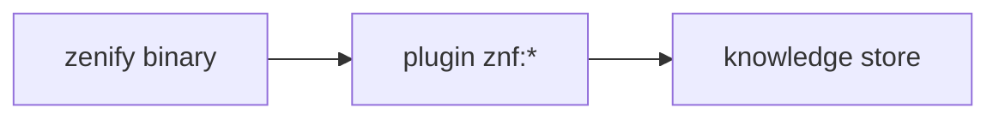

# zenify-kit là gì

`zenify-kit` là bộ ba: binary `zenify` (một file thực thi, không cần Node/Python), plugin skill `znf:*` cho Claude Code, và một knowledge store riêng của team. Cả ba dùng chung cho mọi repo trong workspace zenify — bạn cài một lần, dùng cho contact-center-be, contact-center-web, hub và mọi repo khác. Trang này chỉ đường: bạn đang ở bước nào thì đọc trang tương ứng bên dưới.

## Bạn muốn… → đọc trang

| Bạn muốn | Đọc trang |
|---|---|
| Cài `zenify` lần đầu trên máy mới | [Cài đặt](/getting-started/install) |
| Onboard một workspace, chạy thử lệnh đầu tiên | [Bắt đầu nhanh](/getting-started/quickstart) |
| Nâng cấp lên bản `zenify` mới | [Nâng cấp](/getting-started/upgrade) |
| Hiểu vì sao kit chia 3 lớp binary/plugin/knowledge store | Ba lớp <!-- TODO(Task 8): link /concepts/three-layers --> |
| Chọn quy trình cook / fix / hotfix cho một task cụ thể | Chọn quy trình <!-- TODO(Task 9): link /workflows/ --> |
| Tra cứu một lệnh CLI, skill, agent hoặc hook cụ thể | [Tham chiếu](/reference/cli/) |

## Ba lớp

| Lớp | Nằm ở đâu trên máy | Cập nhật bằng |
|---|---|---|
| Binary `zenify` | trong `PATH` | `zenify update` |
| Plugin skill `znf:*` | `~/.claude/skills/znf` | `zenify skills sync` (chạy tự động trong `zenify up`) |
| Knowledge store | `~/.zenify/knowledge` | `zenify docs sync` (chạy tự động ở hook `Stop`/`SessionStart`) |

Mỗi lớp có chủ sở hữu và cơ chế cập nhật riêng — chi tiết và edge case xem trang khái niệm Ba lớp <!-- TODO(Task 8): link /concepts/three-layers -->.

## Trạng thái dự án

Mọi milestone M0–M9 và W0–W6 đã ship; phiên bản binary hiện tại xem `zenify version`. Roadmap chi tiết theo từng mốc nằm trong knowledge store nội bộ của team, không link ra ngoài từ trang public này.

## Nguồn

- `ARCHITECTURE.md` (repo `zenify-kit`, mục "The public-distribution invariant")
- `README.md` (repo `zenify-kit`, mục "Status")
- Ground trên binary v0.17.7 (2026-09-14).
