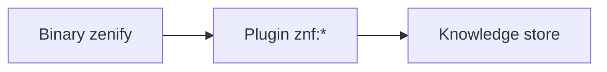

# ZenifyKit là gì

ZenifyKit gồm ba phần: binary `zenify`, plugin skill `znf:*` cho Claude Code, và một knowledge store riêng của team. Binary là một file thực thi, không cần Node hay Python. Bạn cài một lần và dùng cho mọi repo trong workspace zenify: contact-center-be, contact-center-web, hub và các repo khác.

## Chọn điểm bắt đầu

- Nếu mới dùng ZenifyKit, hãy bắt đầu với [Cài đặt](/getting-started/install), rồi làm theo [Bắt đầu nhanh](/getting-started/quickstart) để onboard workspace và tạo worktree đầu tiên.
- Nếu đã cài, đọc phần [Khái niệm](/concepts/three-layers) để hiểu ba lớp của kit, worktree theo slug và knowledge store trước khi làm việc.
- Nếu đang có task, mở [Chọn workflow](/workflows/) để biết nên dùng `/znf:cook`, `/znf:fix` hay `/znf:hotfix`.
- Nếu cần cú pháp chính xác của một lệnh, skill, agent hoặc hook, xem [Tham chiếu](/reference/cli/). Phần này sinh tự động từ binary và plugin.
- Nếu có bản `zenify` mới, xem [Nâng cấp](/getting-started/upgrade).

## Ba lớp

| Lớp | Vị trí trên máy | Cập nhật bằng |
|---|---|---|
| Binary `zenify` | trong `PATH` | `zenify update` |
| Plugin skill `znf:*` | `~/.claude/skills/znf` | `zenify skills sync` (chạy tự động trong `zenify up`) |
| Knowledge store | `~/.zenify/knowledge` | `zenify docs sync` (chạy tự động ở hook `Stop` và `SessionStart`) |

*Ba lớp của ZenifyKit*

Mỗi lớp có chủ sở hữu và cơ chế cập nhật riêng. Chi tiết và các trường hợp đặc biệt xem [Ba lớp](/concepts/three-layers).

## Khái niệm

Sáu trang dưới đây giải thích mô hình mà các trang workflow và tham chiếu dựa vào.

| Trang | Nội dung |
|---|---|
| [Ba lớp: binary, plugin, knowledge store](/concepts/three-layers) | Ba lớp nằm ở đâu trên máy, ai được sửa |
| [Namespace `znf:`](/concepts/znf-namespace) | Vì sao gọi `znf:cook` thay cho bản skill cá nhân trùng tên |
| [Worktree theo slug](/concepts/worktree-per-slug) | Vì sao một task tương ứng một worktree, không phải một lần sửa |
| [Base ref, hotfix base, port block](/concepts/base-ref-and-ports) | Base ref lấy từ đâu, vì sao hotfix resolve sau khi fetch |
| [Knowledge store và view `docs/`](/concepts/knowledge-store) | Store thật ở đâu, `docs/` là gì, ai được ghi |
| [Gate fail-open](/concepts/gate-fail-open) | Vì sao một gate báo lỗi không chặn ship, khác gì với git-guard |

<!-- Nguồn (cho người bảo trì, không hiển thị):
- `ARCHITECTURE.md` (repo `zenify-kit`, mục "The public-distribution invariant")
- `README.md` (repo `zenify-kit`, mục "Status")
-->
