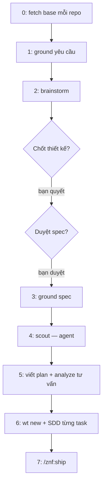

# /znf:cook

## Dùng khi / Không dùng khi

| Dùng khi | Không dùng khi |
|---|---|
| Cần thiết kế hoặc đồng thuận trước khi code | Đã biết vì sao, chỉ sửa một dòng — đi đường không-skill ([Chọn quy trình](/workflows/)) |
| Việc chạm nhiều file | Đang hỏng, chưa biết vì sao — [`/znf:fix`](/workflows/fix) |
| Đụng tài nguyên chung (DB collection, endpoint, queue, channel) | Đang hỏng trên production — [`/znf:hotfix`](/workflows/hotfix) |

## Cách gọi

```text
/znf:cook <mô tả tính năng>
/znf:cook <path/to/plan.md>
```

Agent chỉ **đề xuất** cook, không tự chạy — `/znf:cook` có gate người dùng và ghi ra artifact (spec, plan), nên một dự đoán sai tốn của bạn một lần ngắt ngang giữa chừng nghi lễ. Khi agent thấy việc trông giống cook, nó nói một câu rồi để bạn quyết định, chứ không tự gõ lệnh.

## Viết yêu cầu cho tốt

| Trường | Ví dụ |
|---|---|
| Kết quả mong muốn | Trang tài liệu tĩnh cho `zenify-kit`, host trên Cloudflare Pages |
| Ràng buộc | Chỉ người `@zenify.vn` đọc được; chi phí 0 |
| Ngoài phạm vi | Không viết lại README, không đổi CLI |
| Tiêu chí nhận | Build xanh, không dead link, mọi lệnh ground trên binary thật |
| Repo liên quan | `zenify-kit` |

## Diễn biến một lần chạy



| Bước | Kit làm gì | Bạn thấy / làm gì |
|---|---|---|
| 0 | `git fetch` base ref mỗi repo liên quan | Không cần làm gì |
| 1 | Ground các tên trong yêu cầu (`zenify db-read collections/doc`) | Đọc kết quả ground |
| 2 | Brainstorm 9 bước | **Dừng hỏi: chốt thiết kế**, rồi **dừng hỏi: duyệt spec** trước khi ghi file |
| 3 | Ground lại mọi tên spec vừa chốt | Đọc nếu có mâu thuẫn — spec được sửa trước khi viết plan |
| 4 | `/znf:scout` (agent) tìm ai phụ thuộc vào phần sắp đổi | Đọc báo cáo scout |
| 5 | Viết plan; `/znf:analyze` chạy tư vấn, không chặn | Đọc plan, xem finding analyze nếu có |
| 6 | Tạo worktree, chạy SDD: mỗi task một implementer + một reviewer | Theo dõi ledger `.znf/sdd/<plan>/progress.md` |
| 7 | Gọi `/znf:ship` | Đọc board ship, nhận PR |

## Kết quả nhận được

| Artifact | Đường dẫn |
|---|---|
| Spec | `docs/specs/<repo>/YYYY-MM-DD-<topic>-design.md` (knowledge store) |
| Plan | `docs/plans/<repo>/YYYY-MM-DD-<topic>.md` |
| Ledger tiến độ | `.znf/sdd/<plan>/progress.md` |
| Branch | `<user>/feat/<slug>` |
| PR | Mở, chưa merge |

## Việc chỉ bạn quyết định

- Chốt thiết kế và duyệt spec — hai gate ở bước 2, cook dừng lại chờ bạn ở cả hai.
- Merge PR sau khi ship xong.
- Mọi bước tay ngoài repo (thao tác hạ tầng, thao tác ngoài git).

## Ví dụ

**Thật** — chính site tài liệu này: yêu cầu ban đầu là "doc site cho zenify-kit". Spec ở `docs/specs/zenify-kit/2026-09-14-kit-docs-site-design.md`, plan ở `docs/plans/zenify-kit/2026-09-14-kit-docs-site.md`. Worktree `.worktrees/kit-docs-site`, branch `namph/feat/kit-docs-site`, 10 task SDD. PR mở ở bước ship.

## Tránh / Nên làm

| Tránh | Nên làm |
|---|---|
| "Việc nhỏ, bỏ spec cho nhanh" | Spec ngắn ≠ không có spec — brainstorming cho phép spec vài câu cho việc thật sự đơn giản, không cho phép bỏ hẳn |
| Tự gõ code trong lúc cook đang chạy SDD | Để implementer làm, bạn đọc ledger và can thiệp ở hai gate |
| Merge PR ngay khi thấy PR mở | Đọc board ship trước — review độc lập và verify hành vi nằm ở đó |

## Nguồn

- `internal/plugin/assets/znf/skills/cook/SKILL.md @ b296ca1`
- Xem thêm: [`/reference/skills/cook`](/reference/skills/cook), [Worktree theo slug](/concepts/worktree-per-slug), [Knowledge store](/concepts/knowledge-store), [Chọn quy trình](/workflows/)
- Ground trên binary build từ commit b296ca1 của nhánh này (2026-09-14), chưa phát hành.
