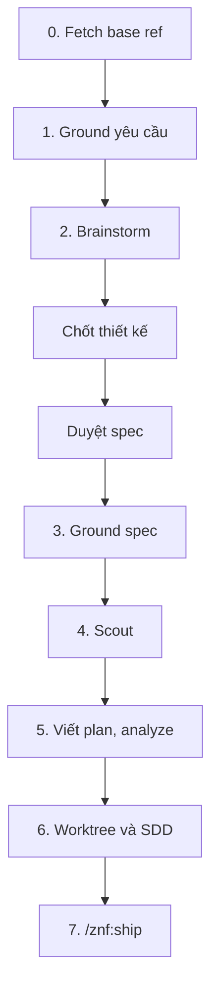

# cook: xây tính năng

`/znf:cook` là workflow xây tính năng từ đầu đến khi mở PR. Nó đi qua brainstorm, spec, ground, plan, implement bằng subagent, rồi gọi `/znf:ship`.

## Khi nào dùng

Dùng `/znf:cook` khi:

- Cần thiết kế hoặc đồng thuận trước khi code.
- Việc chạm nhiều file.
- Việc chạm tài nguyên chung: DB collection, endpoint, queue, channel.

Không dùng `/znf:cook` khi:

- Đã biết vì sao, chỉ sửa một dòng. Đi đường không dùng workflow, xem [Chọn workflow](/workflows/).
- Đang hỏng, chưa biết vì sao. Dùng [`/znf:fix`](/workflows/fix).
- Đang hỏng trên production. Dùng [`/znf:hotfix`](/workflows/hotfix).

## Cách gọi

```text
/znf:cook <mô tả tính năng>
/znf:cook <path/to/plan.md>
```

Agent chỉ đề xuất `/znf:cook`, không tự chạy. Workflow này có gate chờ bạn quyết định và ghi ra spec, plan. Khi agent thấy việc giống cook, nó nói một câu và để bạn gõ lệnh.

## Viết yêu cầu

Yêu cầu càng đủ các trường dưới đây, bước brainstorm càng ngắn.

| Trường | Ví dụ |
|---|---|
| Kết quả mong muốn | Trang tài liệu tĩnh cho `zenify-kit`, host trên Cloudflare Pages |
| Ràng buộc | Chỉ người `@zenify.vn` đọc được; chi phí 0 |
| Ngoài phạm vi | Không viết lại README, không đổi CLI |
| Tiêu chí nhận | Build xanh, không dead link, mọi lệnh ground trên binary thật |
| Repo liên quan | `zenify-kit` |

## Các bước



*Các bước của một lần chạy cook*

| Bước | Kit làm gì | Bạn làm gì |
|---|---|---|
| 0 | `git fetch` base ref của mỗi repo liên quan | Không cần làm gì |
| 1 | Ground các tên trong yêu cầu bằng `zenify db-read collections/doc` | Đọc kết quả ground |
| 2 | Brainstorm 9 bước | Chốt thiết kế, rồi duyệt spec trước khi kit ghi file. Kit dừng chờ bạn ở cả hai gate |
| 3 | Ground lại mọi tên trong spec vừa chốt | Đọc nếu có mâu thuẫn. Spec được sửa trước khi viết plan |
| 4 | Chạy `/znf:scout` (agent) tìm nơi phụ thuộc vào phần sắp đổi | Đọc báo cáo scout |
| 5 | Viết plan. `/znf:analyze` chạy tư vấn, không chặn | Đọc plan, xem finding của analyze nếu có |
| 6 | Tạo worktree, chạy SDD: mỗi task một implementer và một reviewer | Theo dõi ledger `.znf/sdd/<plan>/progress.md` |
| 7 | Gọi `/znf:ship` | Đọc board ship, nhận PR |

## Kết quả

| Artifact | Đường dẫn |
|---|---|
| Spec | `docs/specs/<repo>/YYYY-MM-DD-<topic>-design.md` (knowledge store) |
| Plan | `docs/plans/<repo>/YYYY-MM-DD-<topic>.md` |
| Ledger tiến độ | `.znf/sdd/<plan>/progress.md` |
| Branch | `<user>/feat/<slug>` |
| PR | Mở, chưa merge |

## Quyết định thuộc về bạn

- Chốt thiết kế và duyệt spec. Đây là hai gate ở bước 2, cook dừng chờ bạn ở cả hai.
- Merge PR sau khi ship xong.
- Mọi bước tay ngoài repo, ví dụ thao tác hạ tầng.

## Ví dụ

Chính site tài liệu này được xây bằng `/znf:cook`. Yêu cầu ban đầu là "doc site cho zenify-kit". Kit ghi spec và plan vào knowledge store, tạo worktree `.worktrees/kit-docs-site` với branch `namph/feat/kit-docs-site`, rồi chạy SDD theo từng task. PR mở ở bước ship.

## Lỗi thường gặp

| Tránh | Nên làm |
|---|---|
| Bỏ spec vì việc nhỏ | Viết spec ngắn. Brainstorming cho phép spec vài câu với việc đơn giản, không cho phép bỏ hẳn |
| Tự gõ code trong lúc cook đang chạy SDD | Để implementer làm. Bạn đọc ledger và can thiệp ở hai gate |
| Merge PR ngay khi thấy PR mở | Đọc board ship trước. Review độc lập và verify hành vi nằm ở đó |

## Xem thêm

[`/reference/skills/cook`](/reference/skills/cook), [Worktree theo slug](/concepts/worktree-per-slug), [Knowledge store](/concepts/knowledge-store), [Chọn workflow](/workflows/)

<!-- Nguồn (cho người bảo trì, không hiển thị):
- internal/plugin/assets/znf/skills/cook/SKILL.md @ b296ca1
- internal/plugin/assets/znf/skills/discipline/SKILL.md @ b296ca1 ("suggested, never auto-run")
-->
