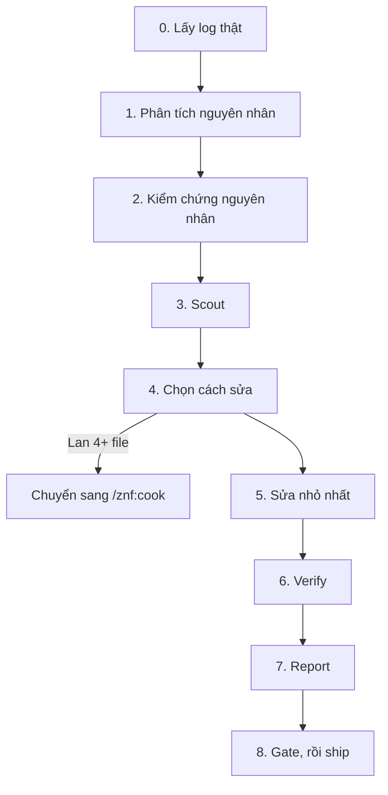

# fix: sửa lỗi chưa rõ nguyên nhân

`/znf:fix` là workflow tìm nguyên nhân và sửa một lỗi. Nó lấy log thật, chứng minh nguyên nhân trước khi sửa, rồi gọi `/znf:gate` và `/znf:ship`.

## Khi nào dùng

Dùng `/znf:fix` khi:

- Có triệu chứng thật (log, lỗi, test fail) và chưa biết nguyên nhân.
- Cần chứng minh nguyên nhân trước khi sửa.

Không dùng `/znf:fix` khi:

- Đang hỏng trên production. Dùng [`/znf:hotfix`](/workflows/hotfix). Hotfix dùng lại bước chẩn đoán của fix.
- Đã biết nguyên nhân và cách sửa chỉ một dòng. Đi đường không dùng workflow, xem [Chọn workflow](/workflows/).

## Cách gọi

```text
/znf:fix <mô tả triệu chứng>
/znf:fix <url github-actions-run>
/znf:fix
```

Không truyền gì thì fix tự lấy log gần nhất. Agent tự route vào `/znf:fix` khi nhận bug report. Điểm này khác với hotfix.

## Viết yêu cầu

| Trường | Ví dụ |
|---|---|
| Triệu chứng nguyên văn | Đúng dòng log hoặc lỗi thật, không diễn giải lại |
| Cách tái hiện | Bước cụ thể, hoặc "không tái hiện được, chỉ có log" |
| Mong đợi | Hành vi đúng phải là gì |
| Môi trường | Repo, branch hoặc base, local hay staging |
| Từ khi nào | Mới xuất hiện hay đã có từ lâu |

## Các bước



*Các bước của một lần chạy fix*

| Bước | Kit làm gì | Bạn làm gì |
|---|---|---|
| 0 | Lấy log hoặc lỗi thật, tự động hoặc từ argument | Xác nhận đúng log |
| 1 | Phân tích nguyên nhân. Hẹp thì một giả thuyết, rộng thì nhiều agent chạy song song | Đọc kết luận |
| 2 | Kiểm chứng nguyên nhân trước khi sửa bất cứ gì | Không sửa gì nếu chưa kiểm chứng được |
| 3 | Chạy `/znf:scout` tìm nơi gọi, đọc, ghi code sắp đổi | Đọc báo cáo scout |
| 4 | Nếu có trade-off thật giữa hai cách sửa, trình bày cho bạn | Chọn cách sửa |
| 4 (leo thang) | Nếu fix lan 4+ file hoặc cần quyết định thiết kế, dừng | Chuyển sang `/znf:cook` thay vì ép sửa trong fix |
| 5 | Sửa nhỏ nhất theo cách đã chọn | Không cần làm gì |
| 6 | Verify bằng cách chạy lại phần đang fail | Đọc kết quả |
| 7 | Ghi báo cáo nguyên nhân và cách sửa | Đọc báo cáo |
| 8 | Chạy `/znf:gate` rồi `/znf:ship` | Đọc board ship, nhận PR |

## Kết quả

| Artifact | Nội dung |
|---|---|
| Báo cáo | Nguyên nhân đã xác nhận, cách sửa, kết quả verify |
| Branch | `<user>/fix/<slug>` |
| PR | Mở, chưa merge |

## Quyết định thuộc về bạn

- Có leo thang sang `/znf:cook` hay không, khi fix vượt quá phạm vi một bug.
- Chọn cách sửa khi có trade-off thật giữa hai lựa chọn hợp lý.
- Merge PR.

## Ví dụ

Một fix thật trong chính ZenifyKit.

Triệu chứng: sau `zenify migrate`, một worktree cũ còn thư mục và branch nhưng git không còn đăng ký nó. `zenify wt rm --force` và `zenify wt sweep` báo lỗi khi gọi git, không dọn được gì.

Nguyên nhân: sau khi di chuyển repo, worktree cũ trỏ tới vị trí git đã bỏ, nên git không còn nhận nó.

Cách sửa: khi git không còn biết worktree đó, kit xoá thư mục trực tiếp, dọn dấu vết trong git và vẫn xoá đúng branch. Fix nằm gọn trong lệnh `wt`, không đổi hành vi khác.

## Lỗi thường gặp

| Tránh | Nên làm |
|---|---|
| Vá triệu chứng cho qua | Chứng minh nguyên nhân bằng bằng chứng thật ở bước 2 trước khi sửa |
| Để fix mọc thành feature | Fix lan 4+ file hoặc cần quyết định thiết kế thì leo thang sang `/znf:cook` |

## Xem thêm

[`/reference/skills/fix`](/reference/skills/fix), [Chọn workflow](/workflows/)

<!-- Nguồn (cho người bảo trì, không hiển thị):
- internal/plugin/assets/znf/skills/fix/SKILL.md @ b296ca1
- Ví dụ: commit c8a7eea fix(wt): delete orphan worktree dirs git no longer registers (origin/main), 3 file, +119/-2
-->
