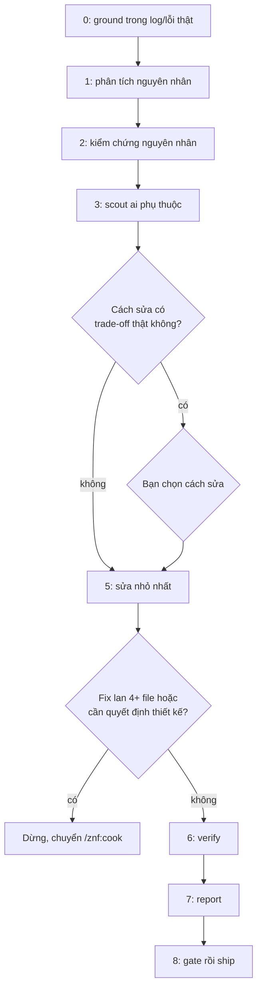

# /znf:fix

## Dùng khi / Không dùng khi

| Dùng khi | Không dùng khi |
|---|---|
| Có triệu chứng thật (log, lỗi, test fail), chưa biết nguyên nhân | Đang hỏng trên production — [`/znf:hotfix`](/workflows/hotfix) (nó dùng lại bước chẩn đoán của fix) |
| Cần chứng minh nguyên nhân trước khi sửa | Đã biết nguyên nhân và cách sửa chỉ một dòng — đi đường không-skill ([Chọn quy trình](/workflows/)) |

## Cách gọi

```text
/znf:fix <mô tả triệu chứng>
/znf:fix <url github-actions-run>
/znf:fix
```

Không truyền gì thì fix tự lấy log gần nhất. Agent **tự route** được khi nhận bug report — khác với hotfix.

## Viết yêu cầu cho tốt

| Trường | Ví dụ |
|---|---|
| Triệu chứng nguyên văn | Đúng dòng log/lỗi thật, không diễn giải lại |
| Cách tái hiện | Bước cụ thể, hoặc "không tái hiện được, chỉ có log" |
| Mong đợi | Hành vi đúng phải là gì |
| Môi trường | Repo, branch/base, local hay staging |
| Từ khi nào | Mới xuất hiện hay đã có từ lâu |

## Diễn biến một lần chạy



| Bước | Kit làm gì | Bạn thấy / làm gì |
|---|---|---|
| 0 | Lấy log/lỗi thật (auto hoặc từ argument) | Xác nhận đúng log |
| 1 | Phân tích nguyên nhân — hẹp (một giả thuyết) hoặc rộng (nhiều agent song song) | Đọc kết luận |
| 2 | **Kiểm chứng nguyên nhân trước khi sửa bất cứ gì** | Không sửa gì nếu chưa kiểm chứng được |
| 3 | `/znf:scout` tìm ai gọi/đọc/ghi code sắp đổi | Đọc báo cáo scout |
| 4 | Nếu có trade-off thật giữa hai cách sửa | **Dừng hỏi: bạn chọn cách sửa** |
| 4 (cửa leo thang) | Nếu fix hoá ra lan 4+ file hoặc cần quyết định thiết kế | **Dừng, chuyển sang `/znf:cook`** thay vì ép sửa trong fix |
| 5 | Sửa nhỏ nhất theo cách đã chọn | Không cần làm gì |
| 6 | Verify — chạy lại cái đang fail | Đọc kết quả |
| 7 | Ghi báo cáo nguyên nhân + fix | Đọc báo cáo |
| 8 | `/znf:gate` rồi `/znf:ship` | Đọc board ship, nhận PR |

## Kết quả nhận được

| Artifact | Nội dung |
|---|---|
| Báo cáo | Nguyên nhân xác nhận + cách sửa + kết quả verify |
| Branch | `<user>/fix/<slug>` |
| PR | Mở, chưa merge |

## Việc chỉ bạn quyết định

- Chấp nhận leo thang sang `/znf:cook` hay không, khi fix vượt quá phạm vi một bug.
- Chọn cách sửa khi có trade-off thật giữa hai lựa chọn hợp lý.
- Merge PR.

## Ví dụ

**Thật** — commit `c8a7eea fix(wt): delete orphan worktree dirs git no longer registers` trên `origin/main`. Triệu chứng: sau `zenify migrate`, một worktree cũ còn thư mục và branch nhưng git không còn đăng ký nó; `zenify wt rm --force` và sweep gọi `git worktree remove` gặp exit 128, không dọn được gì. Nguyên nhân: `.git` file trong worktree cũ trỏ gitdir đã chuyển chỗ, git bỏ nó khi prune. Cách sửa: khi remove fail và `git worktree list --porcelain` không biết path đó, xoá thư mục trực tiếp, prune, lấy branch từ `state.json` (worktree mồ côi không trả lời được `symbolic-ref`). Diff: 3 file, +119/-2 dòng.

## Tránh / Nên làm

| Tránh | Nên làm |
|---|---|
| Vá triệu chứng cho qua | Bước 2 phải chứng minh nguyên nhân bằng bằng chứng thật trước khi sửa |
| Để fix mọc thành feature | Fix lan 4+ file hoặc cần quyết định thiết kế → leo thang sang `/znf:cook` |

## Nguồn

- `internal/plugin/assets/znf/skills/fix/SKILL.md @ b296ca1`
- Xem thêm: [`/reference/skills/fix`](/reference/skills/fix), [Chọn quy trình](/workflows/)
- Ground trên binary build từ commit b296ca1 của nhánh này (2026-09-14), chưa phát hành.
