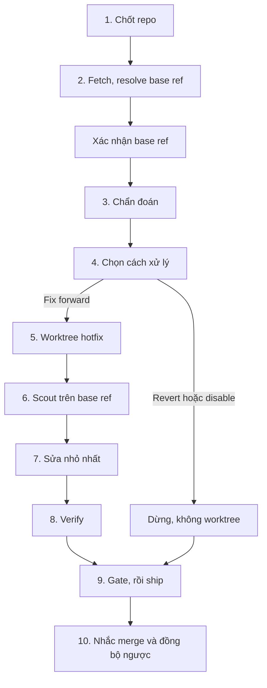

# hotfix: sửa lỗi trên production

`/znf:hotfix` là workflow sửa lỗi đang ảnh hưởng production. Nó branch từ release đang chạy, dùng lại bước chẩn đoán của `/znf:fix`, và để bạn chọn giữa revert, disable hoặc fix forward.

## Khi nào dùng

Dùng `/znf:hotfix` khi lỗi đang ảnh hưởng production và bạn xác nhận độ khẩn.

Không dùng `/znf:hotfix` khi lỗi chỉ xảy ra trên staging hoặc dev. Dùng [`/znf:fix`](/workflows/fix).

## Cách gọi

```text
/znf:hotfix <mô tả ngắn>
```

Chỉ bạn gõ được `/znf:hotfix`. Agent không tự gọi được lệnh này, chỉ đề xuất. Độ khẩn là quyết định của bạn.

## Viết yêu cầu

| Trường | Ví dụ |
|---|---|
| Repo | Repo đang chạy bản lỗi |
| Release đang chạy | Bản đang chạy production, không phải nhánh tích hợp |
| Ảnh hưởng | Ai hoặc luồng nào đang bị chặn |
| Bằng chứng | Log thật, ticket, `docker logs <container>` |

## Các bước



*Các bước của một lần chạy hotfix*

| Bước | Kit làm gì | Bạn làm gì |
|---|---|---|
| 1 | Chốt repo bị ảnh hưởng | Xác nhận đúng repo |
| 2 | `fetch` rồi resolve base ref hotfix bằng `zenify hotfix baseref` | Xác nhận đây đúng là bản đang chạy production |
| 3 | Chẩn đoán bằng bước 0-2 của `/znf:fix` | Đọc nguyên nhân đã xác nhận |
| 4 | Trình bày ba lựa chọn kèm khuyến nghị | Chọn revert, disable hoặc fix forward. Revert và disable dừng tại đây, không tạo worktree |
| 5 | Tạo worktree `--type hotfix --base <release>` (chỉ khi fix forward) | Không cần làm gì |
| 6 | Chạy `/znf:scout` trên ref đã resolve, không phải base thường ngày | Đọc báo cáo scout |
| 7 | Sửa nhỏ nhất | Không cần làm gì |
| 8 | Verify trên code path thật | Đọc kết quả |
| 9 | Chạy `/znf:gate` rồi `/znf:ship`, kể cả khi đang gấp. Ship mở PR vào base ref release | Đọc board ship, nhận PR URL |
| 10 | Nhắc bước tay còn lại | Merge PR (tức là deploy), rồi đồng bộ fix ngược về base feature bằng merge hoặc cherry-pick |

## Kết quả

| Mục | Nội dung |
|---|---|
| Base ref xác nhận | `origin/release<N>` chỉ khi repo khai `release-latest` hoặc `custom`. Mặc định `hotfix baseref` trả ref staging, khi đó bạn truyền `--base` bằng tay |
| Nguyên nhân xác nhận | Kèm bằng chứng thật |
| Cách xử lý đã chọn | Revert, disable hoặc fix forward, kèm lý do |
| Branch (nếu fix forward) | `<user>/hotfix/<slug>` |
| PR | Mở vào base ref release, chưa merge |

## Quyết định thuộc về bạn

- Đây có phải hotfix thật không. Độ khẩn là quyết định của bạn.
- Base ref có đúng là bản đang chạy không.
- Chọn revert, disable hoặc fix forward.
- Merge PR, rồi đồng bộ fix ngược về base feature.

## Ví dụ

Ví dụ minh hoạ, chưa có hotfix thật nên dùng số release giữ chỗ.

`release<N>` đang chạy gặp lỗi, xác nhận qua log thật. Bạn xác nhận base ref `origin/release<N>` và chọn fix forward vì nguyên nhân đã rõ. Kit tạo worktree `--type hotfix --base origin/release<N>`, scout đúng ref đó, sửa, verify, gate rồi ship. Ship mở PR vào `release<N>`. Bạn merge rồi cherry-pick fix về base feature.

## Lỗi thường gặp

| Tránh | Nên làm |
|---|---|
| Resolve release rồi mới fetch | Luôn `fetch` trước rồi resolve. Nếu không, ref có thể cũ hơn bản đang chạy |
| Fix forward dưới áp lực khi còn phân vân | Chọn revert khi fix forward cần quyết định thiết kế. Lúc gấp không phải lúc thiết kế |
| Quên đồng bộ ngược về base feature | Bước 10 luôn nhắc. Release sau vẫn cần fix này |

## Xem thêm

[`/reference/skills/hotfix`](/reference/skills/hotfix), [Base ref, hotfix base, port block](/concepts/base-ref-and-ports), [Chọn workflow](/workflows/)

<!-- Nguồn (cho người bảo trì, không hiển thị):
- internal/plugin/assets/znf/skills/hotfix/SKILL.md @ b296ca1 (disable-model-invocation: true)
-->
