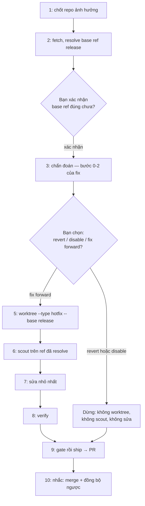

# /znf:hotfix

## Dùng khi / Không dùng khi

| Dùng khi | Không dùng khi |
|---|---|
| Lỗi đang ảnh hưởng production, bạn xác nhận độ khẩn | Lỗi trên staging/dev — [`/znf:fix`](/workflows/fix) |

## Cách gọi

```text
/znf:hotfix <mô tả ngắn>
```

`/znf:hotfix` **chỉ bạn gõ được** (`disable-model-invocation: true`) — agent chỉ được **đề xuất**, độ khẩn là quyết định của bạn.

## Viết yêu cầu cho tốt

| Trường | Ví dụ |
|---|---|
| Repo | Repo đang chạy bản lỗi |
| Release đang chạy | Bản đang chạy production, không phải nhánh tích hợp |
| Ảnh hưởng | Ai/luồng đang bị chặn |
| Bằng chứng | Log thật, ticket, `docker logs <container>` |

## Diễn biến một lần chạy



| Bước | Kit làm gì | Bạn thấy / làm gì |
|---|---|---|
| 1 | Chốt repo bị ảnh hưởng | Xác nhận đúng repo |
| 2 | `fetch` rồi resolve base ref hotfix (`zenify hotfix baseref`) | **Dừng hỏi: bạn xác nhận đây đúng là bản đang chạy production** |
| 3 | Chẩn đoán bằng bước 0-2 của `/znf:fix` | Đọc nguyên nhân đã xác nhận |
| 4 | Trình bày ba lựa chọn kèm khuyến nghị | **Dừng hỏi: bạn chọn revert / disable / fix forward** — revert/disable dừng tại đây, không tạo worktree |
| 5 | Tạo worktree `--type hotfix --base <release>` (chỉ fix forward) | Không cần làm gì |
| 6 | `/znf:scout` trên ref đã resolve, không phải base thường ngày | Đọc báo cáo scout |
| 7 | Sửa nhỏ nhất | Không cần làm gì |
| 8 | Verify trên code path thật | Đọc kết quả |
| 9 | `/znf:gate` rồi `/znf:ship` luôn, kể cả đang gấp — ship mở PR vào base ref release | Đọc board ship, nhận PR URL |
| 10 | Nhắc bước tay còn lại | **Bạn tự tay**: merge PR (= deploy), rồi đồng bộ fix ngược về base feature (merge/cherry-pick) |

## Kết quả nhận được

| Mục | Nội dung |
|---|---|
| Base ref xác nhận | `origin/release<N>` chỉ khi repo khai `release-latest`/`custom`; mặc định `hotfix baseref` trả ref staging, `--base` phải cho tay |
| Nguyên nhân xác nhận | Kèm bằng chứng thật |
| Response đã chọn | revert / disable / fix forward, kèm lý do |
| Branch (nếu fix forward) | `<user>/hotfix/<slug>` |
| PR | Mở vào base ref release, chưa merge |

## Việc chỉ bạn quyết định

- Đây có phải hotfix thật không — độ khẩn là quyết định của bạn.
- Base ref đúng là bản đang chạy.
- Chọn revert / disable / fix forward.
- Merge PR, và đồng bộ fix ngược về base feature.

## Ví dụ

**Minh hoạ** (chưa có hotfix thật, dùng số release giữ chỗ): `release<N>` đang chạy gặp lỗi, xác nhận qua log thật. Bạn xác nhận base ref `origin/release<N>`, chọn fix forward vì nguyên nhân đã rõ. Kit tạo worktree `--type hotfix --base origin/release<N>`, scout đúng ref đó, sửa, verify, gate rồi ship — ship mở PR vào `release<N>`. Bạn merge rồi cherry-pick fix về base feature.

## Tránh / Nên làm

| Tránh | Nên làm |
|---|---|
| Resolve release rồi mới fetch | Luôn `fetch` trước rồi resolve — nếu không có thể ra ref cũ hơn bản đang chạy |
| Sửa tiến dưới áp lực khi còn phân vân | Chọn revert khi sửa tiến cần quyết định thiết kế, không phải lúc đang gấp |
| Quên đồng bộ ngược về base feature | Bước 10 luôn nhắc — release sau vẫn cần fix này |

## Nguồn

- `internal/plugin/assets/znf/skills/hotfix/SKILL.md @ b296ca1`
- Xem thêm: [`/reference/skills/hotfix`](/reference/skills/hotfix), [Base ref, hotfix base, port block](/concepts/base-ref-and-ports), [Chọn quy trình](/workflows/)
- Ground trên binary build từ commit b296ca1 của nhánh này (2026-09-14), chưa phát hành.
