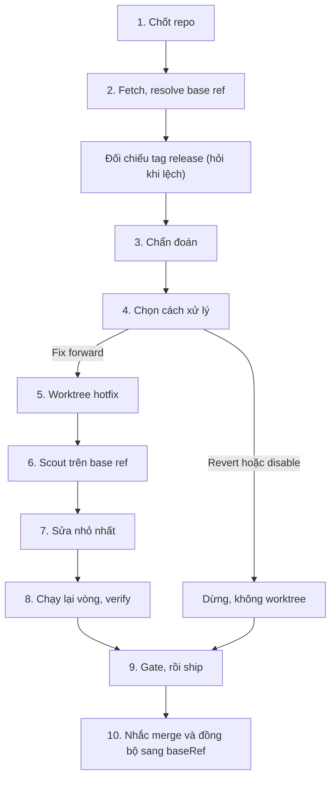

# hotfix: sửa lỗi trên production

`/znf:hotfix` là workflow sửa lỗi đang ảnh hưởng production. Nó branch từ base hotfix mà repo khai trong `worktree.json` (ví dụ `origin/main`), dùng lại bước chẩn đoán của `/znf:fix`, và tự quyết hoặc hỏi bạn chọn giữa revert, disable hoặc fix forward.

## Khi nào dùng

Dùng `/znf:hotfix` khi lỗi đang ảnh hưởng production.

Không dùng `/znf:hotfix` khi lỗi chỉ xảy ra trên staging hoặc dev. Dùng [`/znf:fix`](/workflows/fix).

## Cách gọi

```text
/znf:hotfix <mô tả ngắn>
```

Agent tự gọi `/znf:hotfix` khi `/znf:fix` thấy bằng chứng production; bạn cũng gõ trực tiếp được. Merge vẫn là của bạn.

## Viết yêu cầu

| Trường | Ví dụ |
|---|---|
| Repo | Repo đang chạy bản lỗi |
| Base hotfix | Ref mà production đang chạy, do `zenify hotfix baseref` in ra |
| Ảnh hưởng | Ai hoặc luồng nào đang bị chặn |
| Bằng chứng | Log, trace hoặc metric thật, ticket |

## Các bước


```mermaid
flowchart TD
  A["1. Chốt repo"] --> B["2. Fetch, resolve base ref"]
  B --> C["Đối chiếu tag release (hỏi khi lệch)"]
  C --> D["3. Chẩn đoán"]
  D --> E["4. Chọn cách xử lý"]
  E -->|Revert hoặc disable| F["Dừng, không worktree"]
  E -->|Fix forward| G["5. Worktree hotfix"]
  G --> H["6. Scout trên base ref"]
  H --> I["7. Sửa nhỏ nhất"]
  I --> J["8. Chạy lại vòng, verify"]
  J --> K["9. Gate, rồi ship"]
  F --> K
  K --> L["10. Nhắc merge và đồng bộ sang baseRef"]
  class A,B,C,D,G,H,I,J,K,L action
  class E user
  class F stop
```

*Các bước của một lần chạy hotfix*

| Bước | Kit làm gì | Bạn làm gì |
|---|---|---|
| 1 | Chốt repo bị ảnh hưởng | Xác nhận đúng repo |
| 2 | `fetch --tags` rồi resolve base ref hotfix bằng `zenify hotfix baseref`, và đối chiếu tag release: base chứa tag mới nhất thì tự xác nhận | Chỉ trả lời khi base không chứa tag nào hoặc không chứa tag mới nhất |
| 3 | Nếu được `/znf:fix` chuyển sang thì dùng luôn bằng chứng và nguyên nhân đã xác nhận, không chẩn đoán lại. Nếu không, chẩn đoán bằng bước 0-2 của `/znf:fix`. Ở bước này agent tự chạy các cách tái hiện chỉ đọc trên production và lọc output thành `<REDACTED>`; cách nào có side effect thì đi qua `zenify data run` (dry-run trước, chờ "ok" của bạn trước `--prd --write`); nếu không có thì xác nhận nguyên nhân từ log, không dừng và không thêm log tạm trên production. Nguồn bằng chứng (log, trace, metric, `db-read`/`redis-read`, PostHog) và thứ tự tra cứu lấy từ tài liệu tham chiếu chung `_shared/evidence-sources`, xem [Quan sát và an toàn](/guides/observe-and-safety#nguon-bang-chung-cho-agent) | Đọc nguyên nhân đã xác nhận |
| 4 | Dùng `git blame` trên đúng dòng lỗi (lấy từ bản của base hotfix) để tìm commit cuối cùng chạm vào dòng đó. Commit đó có trước tag release liền trước thì tự fix forward và ghi lý do. Còn lại (không có tag liền trước, không chỉ ra được đúng một dòng lỗi, lỗi có thể do lần deploy gần nhất) thì trình bày ba lựa chọn kèm khuyến nghị | Chỉ chọn revert, disable hoặc fix forward khi được hỏi. Revert và disable dừng tại đây, không tạo worktree |
| 5 | Tạo worktree `--type hotfix --base <base hotfix>` (chỉ khi fix forward) | Không cần làm gì |
| 6 | Chạy `/znf:scout` trên ref đã resolve, không phải base thường ngày | Đọc báo cáo scout |
| 7 | Dựng lệnh đỏ và viết regression test trước (theo bước 5 của `/znf:fix`), xác nhận chúng fail, rồi sửa nhỏ nhất | Không cần làm gì |
| 8 | Chạy lại lệnh đỏ, kỳ vọng xanh, xoá log `[DEBUG-xxxx]` (theo bước 6 của `/znf:fix`), verify trên code path thật | Đọc kết quả |
| 9 | Chạy `/znf:gate` rồi `/znf:ship`, kể cả khi đang gấp. Trước khi ship, đếm file đã đổi so với base hotfix, tính cả file chưa commit và file mới; quá 3 file hoặc đụng tài nguyên dùng chung thì hỏi bạn, khuyên revert. `/znf:ship` mở PR vào base hotfix; skill không merge | Đọc board ship, nhận PR URL. Trả lời khi bị hỏi về diff lớn |
| 10 | Nhắc bước tay còn lại | Merge PR (tức là deploy), rồi đồng bộ base hotfix sang `baseRef` của repo (với zenify là `main → staging`; bỏ qua khi hai ref trùng nhau) |
| Sau deploy | Khi một tag release đã chứa commit merge, kiểm tra kết quả trên đúng vùng fix chạm tới: chỉ chạy các kiểm tra hợp với vùng đó (backend: tỉ lệ lỗi, p95 và số dòng lỗi của route; web: exception PostHog của màn hình; queue: backlog hoặc lag), so cửa sổ trước và sau deploy có độ dài bằng nhau, kèm số request để phân biệt "0 lỗi" với "0 request". Số liệu ghi vào báo cáo hotfix; kiểm tra không chạy được thì ghi là chưa chạy, không ghi là sạch | Đọc số liệu. Triệu chứng chưa giảm hoặc chỉ số lân cận tăng thì chọn lại cách xử lý như bước 4 |

## Kết quả

| Mục | Nội dung |
|---|---|
| Base ref xác nhận | Ref do `zenify hotfix baseref` in ra từ `worktree.json` của repo, ví dụ `origin/main`. Repo chưa khai `hotfixBaseRef` thì lệnh dùng `baseRef` và in cảnh báo; config sai (`release-latest`, `custom` thiếu ref) thì lệnh báo lỗi. Cả hai trường hợp đều sửa `worktree.json`, không đoán tên nhánh |
| Nguyên nhân xác nhận | Kèm bằng chứng thật |
| Cách xử lý đã chọn | Revert, disable hoặc fix forward, kèm lý do |
| Branch (nếu fix forward) | `<user>/hotfix/<slug>` |
| PR | Mở vào base ref hotfix, chưa merge |

## Quyết định thuộc về bạn

- Base ref khi tag release không đủ để kit tự xác nhận.
- Chọn revert, disable hoặc fix forward khi kit hỏi.
- Có tiếp tục khi diff quá 3 file hoặc đụng tài nguyên dùng chung không.
- Merge PR, rồi đồng bộ base hotfix sang `baseRef` của repo (với zenify là `main → staging`; bỏ qua khi hai ref trùng nhau).

## Ví dụ

Ví dụ minh hoạ, repo khai `"hotfix": {"baseStrategy": "custom"}` và `"hotfixBaseRef": "origin/main"`.

Bản production cắt từ `main` gặp lỗi, xác nhận qua log thật. `zenify hotfix baseref` in `origin/main`, base chứa tag release mới nhất nên kit tự xác nhận, và tự chọn fix forward vì lỗi có trước tag liền trước. Kit tạo worktree `--type hotfix --base origin/main`, scout đúng ref đó, dựng lệnh đỏ và viết regression test, sửa, chạy lại lệnh đỏ để verify, gate rồi ship. `/znf:ship` mở PR vào `main`. Bạn merge rồi đồng bộ `main → staging`.

## Lỗi thường gặp

| Tránh | Nên làm |
|---|---|
| Resolve base hotfix rồi mới fetch | Luôn `fetch` trước rồi resolve. Nếu không, ref có thể cũ hơn bản đang chạy |
| Fix forward dưới áp lực khi còn phân vân | Chọn revert khi fix forward cần quyết định thiết kế. Lúc gấp không phải lúc thiết kế |
| Quên đồng bộ base hotfix sang `baseRef` | Bước 10 luôn nhắc. Release sau vẫn cần fix này |

## Xem thêm

[`/reference/skills/hotfix`](/reference/skills/hotfix), [Base ref, hotfix base, port block](/concepts/base-ref-and-ports), [Chọn workflow](/workflows/)

<!-- Nguồn (cho người bảo trì, không hiển thị):
- internal/plugin/assets/znf/skills/hotfix/SKILL.md @ 57df384
-->
