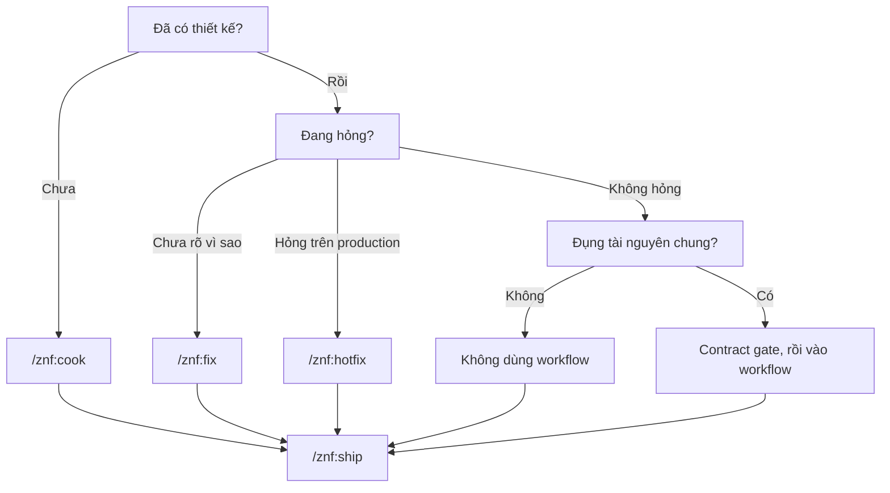

# Chọn workflow

zenify-kit có ba workflow: `/znf:cook`, `/znf:fix` và `/znf:hotfix`. Với thay đổi nhỏ đã rõ yêu cầu, bạn không cần workflow nào, chỉ cần làm trong worktree rồi chạy `/znf:ship`.

Tiêu chí chọn là mức độ bạn đã hiểu về công việc, không phải kích cỡ thay đổi.

## Bảng chọn

| Tình huống | Dùng |
|---|---|
| Chưa có thiết kế, hoặc chưa rõ cần làm gì | `/znf:cook` |
| Có lỗi, chưa biết nguyên nhân | `/znf:fix` |
| Đã biết nguyên nhân, lỗi đang xảy ra trên production | `/znf:hotfix` |
| Đã rõ yêu cầu và cách làm, trong một repo, không chạm tài nguyên chung | Không dùng workflow. Mở worktree, sửa, verify, chạy `/znf:ship` |

*Luồng chọn workflow*

Tài nguyên chung là thứ nhiều service cùng dùng: collection trong DB, endpoint giữa các service, queue, channel pub/sub. Khi thay đổi chạm vào một trong số này, bạn chạy contract gate của project và đi theo workflow thay vì làm trực tiếp.

## Khi nào dùng hotfix

`/znf:cook` và `/znf:fix` phân biệt theo mức hiểu về công việc. `/znf:hotfix` phân biệt theo nơi code sẽ được merge.

Hotfix tạo branch từ release đang chạy, không từ nhánh tích hợp hằng ngày. Phần chẩn đoán dùng lại các bước của `/znf:fix`. Xem chi tiết ở [hotfix](/workflows/hotfix).

## Bước cuối: ship

Mọi đường đều kết thúc bằng `/znf:ship`.

- `/znf:cook` gọi ship ở bước cuối.
- `/znf:fix` và `/znf:hotfix` gọi ship sau khi verify.
- Khi không dùng workflow, bạn tự chạy `/znf:ship` sau khi sửa xong.

Kit không có tùy chọn bỏ bớt bước. Nếu thay đổi đủ nhỏ để không cần `/znf:cook`, hãy chọn đường không dùng workflow ngay từ đầu.

## Skill dùng độc lập

Ba workflow trên tự gọi các skill sau khi cần. Bạn cũng có thể gọi trực tiếp.

| Skill | Chức năng | Dùng trực tiếp khi |
|---|---|---|
| `/znf:ground` | Đối chiếu tên, field, shape với nguồn thật | Sắp dùng một field DB, API hoặc symbol chưa kiểm trong phiên này |
| `/znf:scout` | Liệt kê nơi phụ thuộc vào code sắp sửa | Sắp sửa code hoặc data shape đã có nơi khác dùng |
| `/znf:gate` | Quét cross-repo cho một tài nguyên chung, chỉ đọc | Vừa sửa collection, endpoint, queue hoặc channel chung |
| `/znf:run` | Chạy app trong worktree hiện tại, trả về URL | Cần quan sát hành vi thật của app |
| `/znf:sweep` | Dọn dev server, worktree và branch đã merge | Công việc đã merge, cần dọn workspace |
| `/znf:research` | Research có kiểm chứng: worker fetch nguồn, verifier fetch lại từng URL, báo cáo ghi vào `docs/reference/` | Thiết kế phụ thuộc thư viện, API ngoài hoặc cách người khác làm; brainstorming tự gọi khi checklist năm mục bật. Xem [Research có kiểm chứng](/concepts/research) |
| `/znf:advisor` | Ý kiến thứ hai từ model mạnh trong context mới, ghi vào route-log | Cần ý kiến thứ hai nhanh mà không muốn đổi model cả phiên. Xem [`/reference/skills/advisor`](/reference/skills/advisor) |

<!-- Nguồn (cho người bảo trì, không hiển thị):
- `internal/plugin/assets/znf/skills/discipline/SKILL.md`, mục 0: hai tiêu chí chọn và bốn điều kiện bỏ workflow
- `internal/plugin/assets/znf/skills/using-zenify-kit/SKILL.md`: bảng route
-->
