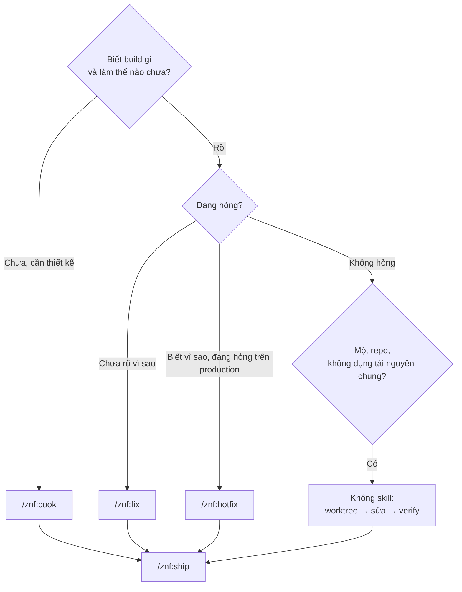

# Chọn quy trình

Kit có bốn cách vào việc: `/znf:cook`, `/znf:fix`, `/znf:hotfix`, hoặc không skill nào cả — chỉ kỷ luật nền (worktree → sửa → verify → `/znf:ship`). Bạn chọn theo cái gì bạn **chưa biết**, không theo việc lớn hay nhỏ.

## Bảng tình huống → gõ gì

| Tình huống | Gõ gì |
|---|---|
| Chưa biết build gì, hoặc chưa biết làm thế nào — chưa có thiết kế đồng thuận | `/znf:cook` |
| Đang hỏng, chưa biết vì sao | `/znf:fix` |
| Biết cả cái gì và vì sao, nhưng đang hỏng trên production | `/znf:hotfix` |
| Biết cả cái gì và vì sao, một repo, không đụng tài nguyên chung | Không skill — chỉ kỷ luật nền: worktree → sửa → verify → `/znf:ship` |

`/znf:hotfix` nằm trên một trục khác với `/znf:cook`/`/znf:fix`: nó không hỏi "biết gì chưa" mà hỏi "code hạ cánh ở đâu" — base ref là release đang chạy, không phải nhánh tích hợp thường ngày. Vì vậy hotfix **ghép** với fix (dùng lại bước chẩn đoán của fix) chứ không thay thế fix.

## Mọi đường kết ở ship

Cả bốn đường đều đi qua `/znf:ship`: `/znf:cook` gọi nó ở bước cuối, `/znf:fix` và `/znf:hotfix` gọi nó vô điều kiện sau khi verify, còn đường không-skill thì bạn tự gõ `/znf:ship` khi code xong. Không có đường nào bỏ qua bước này — kể cả một dòng sửa đã biết chắc vì sao.

## Không có cờ tắt

Kit không có `--fast`, không có `--auto`, không có cách bỏ bớt bước để đi nhanh hơn. `/znf:cook` nói rõ: không có "phân loại độ phức tạp" để rút gọn quy trình — việc thật sự nhỏ (một dòng, đã biết chắc vì sao) thì ngay từ đầu không nên vào `/znf:cook`, mà đi đường không-skill. Vào rồi thì đủ bước, ở mọi kích cỡ.

## Skill gọi riêng được

Năm skill dưới đây gọi riêng được bất cứ lúc nào, không phải chỉ khi nằm trong cook/fix/hotfix:

| Skill | Skill làm gì | Khi nào đáng gọi riêng |
|---|---|---|
| `/znf:ground` | Kiểm một tên/field/shape trước khi dùng, đối chiếu nguồn thật | Sắp viết code chạm một field DB, API, symbol trong repo mà phiên này chưa verify |
| `/znf:scout` | Tìm ai đang phụ thuộc vào code sắp sửa | Sắp sửa code hoặc data shape đã có người dùng, ngoài một lần chạy cook/fix/hotfix |
| `/znf:gate` | Sweep cross-repo cho một resource chung, chỉ đọc | Vừa sửa xong một collection/endpoint/queue/channel chung, muốn biết những repo nào bị ảnh hưởng |
| `/znf:run` | Bật app trong đúng worktree, trả về URL thật | Cần quan sát hành vi thật ngoài phạm vi một task SDD cụ thể |
| `/znf:sweep` | Dọn dev server, worktree, branch đã merge | Việc đã merge xong, muốn đưa workspace về sạch |

Gọi riêng được, nhưng `/znf:cook`, `/znf:fix`, `/znf:hotfix` mới là ba workflow bạn dùng thường xuyên nhất — chúng tự gọi năm skill này đúng lúc, trong lúc chạy.

## Nguồn

- `internal/plugin/assets/znf/skills/discipline/SKILL.md @ b296ca1` §0 (Dial A/Dial B, "không có cờ tắt")
- `internal/plugin/assets/znf/skills/using-zenify-kit/SKILL.md @ b296ca1` bảng route
- Ground trên binary build từ commit b296ca1 của nhánh này (2026-09-14), chưa phát hành.
