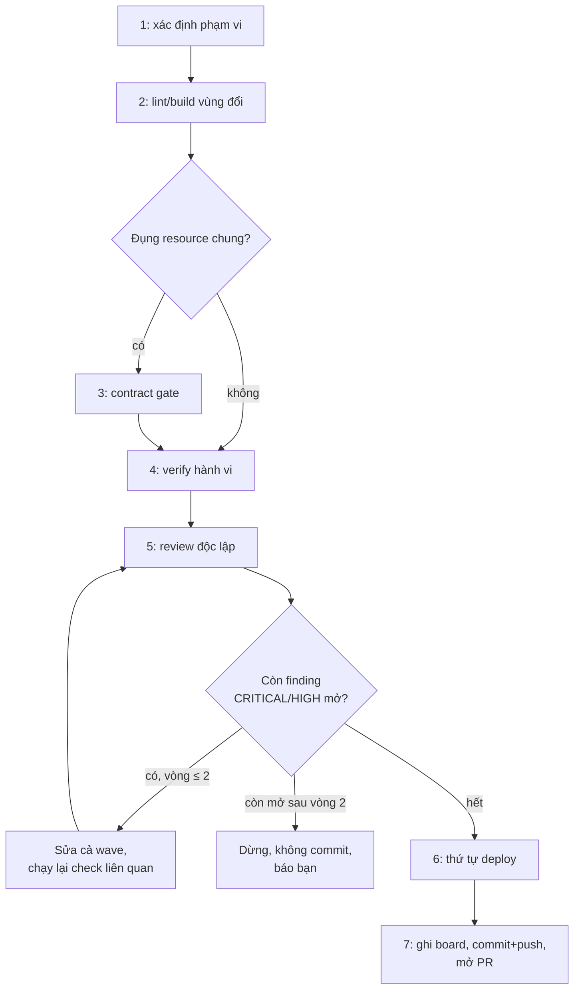

# /znf:ship

## Dùng khi / Không dùng khi

| Dùng khi | Không dùng khi |
|---|---|
| Code đã xong, sắp commit — dù `/znf:cook`, `/znf:fix`, `/znf:hotfix` gọi tới, hay bạn đi đường không-skill | Chưa verify được gì — ship không thay thế bước tự chạy thử code |

## Cách gọi

```text
/znf:ship
```

Agent **tự route** được vào ship khi code xong — không cần bạn gõ lệnh. Ba workflow còn lại gọi ship vô điều kiện ở bước cuối của chúng.

## Viết yêu cầu cho tốt

| Trường | Ví dụ |
|---|---|
| Intent | Đường dẫn plan nếu tới từ `/znf:cook`; nguyên nhân đã xác nhận nếu tới từ `/znf:fix`/`/znf:hotfix`; mục tiêu bạn nêu ra nếu đi đường không-skill |

Ship tự suy ra phạm vi từ file đã đổi — bạn không cần liệt kê gì thêm.

## Diễn biến một lần chạy



| Bước | Kit làm gì | Bạn thấy / làm gì |
|---|---|---|
| 1 | Xác định vùng thay đổi từ file đã đổi | Không cần làm gì |
| 2 | Lint + build/typecheck vùng đó, output thật | Đọc output |
| 3 | Nếu đụng DB collection/endpoint/queue/channel chung, chạy contract gate | Đọc repo nào bị ảnh hưởng |
| 4 | Verify hành vi — test nếu có, hoặc `/znf:run`; UI thì dispatch `znf:ui-verifier` | Đọc kết quả, kể cả số liệu overflow nếu là UI |
| 5 | Review độc lập; CRITICAL/HIGH vào vòng sửa, MEDIUM/LOW lên board | Đọc finding |
| loop | Sửa hết finding mở trong một wave, chạy lại check liên quan, tối đa 2 vòng | **Nếu còn mở sau vòng 2: dừng, không commit, báo bạn** |
| 6 | Xác định thứ tự deploy (đa service) | Đọc thứ tự |
| 7 | Ghi board vào file, commit + push branch, mở PR | Đọc board (`cat`, không phải bản tóm tắt), nhận PR URL |

## Kết quả nhận được

| Artifact | Nội dung |
|---|---|
| Board | `${TMPDIR:-/tmp}/ship-board-<fp10>.md` — mọi dòng ✅/❌ kèm fingerprint, đọc bằng `cat`, không tóm tắt |
| PR | Mở, chưa merge |

## Việc chỉ bạn quyết định

- Merge PR — ship không bao giờ tự merge, kể cả PR nó vừa mở.
- Xử lý finding còn mở sau vòng sửa thứ 2 — ship dừng và báo lại cho bạn, không tự quyết.

## Ví dụ

**Thật** — PR của chính site tài liệu này. Ship của task cuối cùng trong plan `2026-09-14-kit-docs-site` sẽ mở PR này (PR mở ở bước ship — điền số PR khi có).

## Tránh / Nên làm

| Tránh | Nên làm |
|---|---|
| "Review sạch thì bỏ verify" | Board phải có đủ dòng — lint, build, contract gate, verify hành vi, review, đều bắt buộc |
| "Merge vì CI xanh" | Đọc board trước — CI xanh không thay thế review độc lập hay verify hành vi trong board |

## Nguồn

- `internal/plugin/assets/znf/skills/ship/SKILL.md @ b296ca1`
- Xem thêm: [`/reference/skills/ship`](/reference/skills/ship), [Gate fail-open](/concepts/gate-fail-open), [Chọn quy trình](/workflows/)
- Ground trên binary build từ commit b296ca1 của nhánh này (2026-09-14), chưa phát hành.
