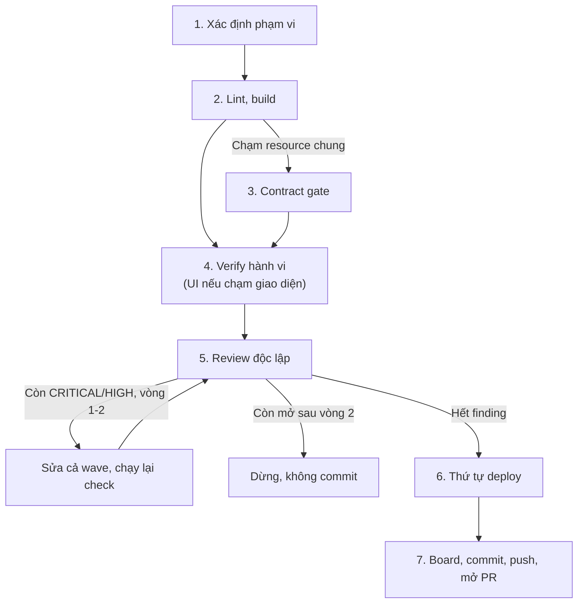

# ship: verify và mở PR

`/znf:ship` là bước cuối của mọi workflow. Nó chạy lint, build, contract gate, verify hành vi (gồm **kiểm thử UI** khi diff chạm giao diện) và review độc lập, rồi commit, push và mở PR. Ship không merge.

## Khi nào dùng

Dùng `/znf:ship` khi code đã xong và sắp commit. Ba workflow `/znf:cook`, `/znf:fix`, `/znf:hotfix` gọi ship ở bước cuối. Khi đi đường không dùng workflow, bạn tự gọi.

Không dùng `/znf:ship` khi chưa verify được gì. Ship không thay thế bước tự chạy thử code.

## Cách gọi

```text
/znf:ship
```

Agent tự route vào ship khi code xong, bạn không cần gõ lệnh. Ba workflow còn lại gọi ship vô điều kiện ở bước cuối.

## Viết yêu cầu

Ship tự suy ra phạm vi từ file đã đổi. Bạn không cần liệt kê gì thêm.

| Trường | Nội dung |
|---|---|
| Intent | Đường dẫn plan nếu tới từ `/znf:cook`. Nguyên nhân đã xác nhận nếu tới từ `/znf:fix` hoặc `/znf:hotfix`. Mục tiêu bạn nêu ra nếu đi đường không dùng workflow |

## Các bước



*Các bước của một lần chạy ship*

| Bước | Kit làm gì | Bạn làm gì |
|---|---|---|
| 1 | Xác định vùng thay đổi từ file đã đổi | Không cần làm gì |
| 2 | Lint và build/typecheck vùng đó, lấy output thật | Đọc output |
| 3 | Nếu chạm DB collection, endpoint, queue hoặc channel chung, chạy contract gate | Đọc repo nào bị ảnh hưởng |
| 4 | Verify hành vi: test nếu có, hoặc `/znf:run`. **Nếu diff chạm giao diện**, ship kiểm thử UI — golden-diff `zenify visual check` (khi repo có `.znf/visual/routes.json`) rồi `znf:ui-verifier` đo overflow phần tử đã đổi. Chi tiết ở [Kiểm thử UI](/workflows/ui-testing) | Đọc kết quả, kể cả số liệu overflow nếu là UI |
| 5 | Review độc lập. CRITICAL/HIGH vào vòng sửa, MEDIUM/LOW lên board | Đọc finding |
| Vòng sửa | Sửa hết finding mở trong một wave, chạy lại check liên quan, tối đa 2 vòng | Nếu còn mở sau vòng 2, ship dừng, không commit, và báo bạn |
| 6 | Xác định thứ tự deploy (đa service) | Đọc thứ tự |
| 7 | Ghi board vào file, commit và push branch, mở PR | Đọc board bằng `cat`, không đọc bản tóm tắt. Nhận PR URL |

## Kết quả

| Artifact | Nội dung |
|---|---|
| Board | `${TMPDIR:-/tmp}/ship-board-<fp10>.md`. Mọi dòng ✅/❌ kèm fingerprint. Đọc bằng `cat`, không tóm tắt |
| PR | Mở, chưa merge |

## Quyết định thuộc về bạn

- Merge PR. Ship không tự merge, kể cả PR nó vừa mở.
- Xử lý finding còn mở sau vòng sửa thứ 2. Ship dừng và báo lại, không tự quyết.

## Ví dụ

PR của chính site tài liệu này do ship mở, ở bước cuối của lần chạy `/znf:cook` xây site.

## Lỗi thường gặp

| Tránh | Nên làm |
|---|---|
| Bỏ verify vì review sạch | Board phải đủ dòng: lint, build, contract gate, verify hành vi, review. Tất cả bắt buộc |
| Merge vì CI xanh | Đọc board trước. CI xanh không thay thế review độc lập hay verify hành vi trong board |

## Xem thêm

[`/reference/skills/ship`](/reference/skills/ship), [Gate fail-open](/concepts/gate-fail-open), [Chọn workflow](/workflows/)

<!-- Nguồn (cho người bảo trì, không hiển thị):
- internal/plugin/assets/znf/skills/ship/SKILL.md @ b296ca1
- Ví dụ: PR docs site từ plan 2026-09-14-kit-docs-site
-->
