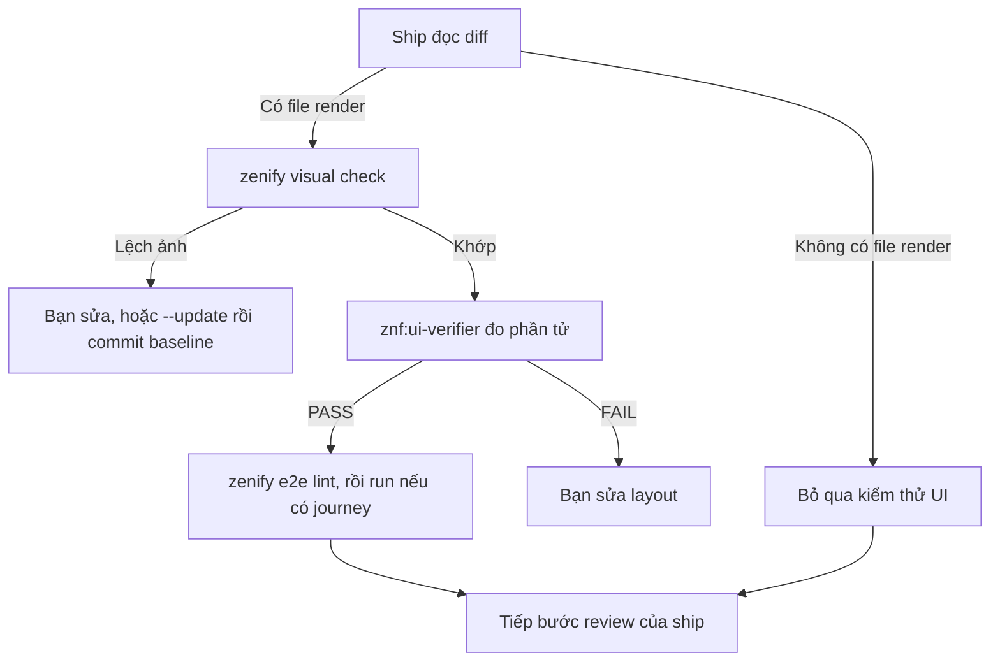

# Kiểm thử UI

Một thay đổi giao diện có thể qua mọi test hành vi mà vẫn hỏng khi nhìn: chữ bị cắt, nút tràn khỏi ô, bảng lệch cột. Kit vì vậy kiểm thử UI theo ba lớp, mỗi lớp bắt một loại lỗi khác nhau.

| Lớp | Công cụ | Bắt lỗi gì |
|---|---|---|
| Đo phần tử vừa đổi | agent `znf:ui-verifier` | Tràn, cắt chữ, lệch của chính phần tử bạn sửa |
| So ảnh toàn trang | `zenify visual check` | Lệch ở vùng bạn không định đụng tới |
| Journey E2E | `zenify e2e run` | Luồng người dùng không còn đổi được trạng thái thật của dữ liệu |

Cả ba lớp đều chạy trên dev server của worktree, không chạy trên staging.

## Khi nào chạy

`/znf:ship` quyết định ở bước verify. Nếu diff chạm file `.tsx`, `.jsx`, `.vue`, `.svelte`, file style, hoặc thư mục `components`, `pages`, `views`, ship coi thay đổi có render và bật kiểm thử UI. Diff không chạm các file đó thì ship ghi "nothing renders in this diff" và bỏ qua.

Khi bật, thứ tự cố định:

1. Repo có `.znf/visual/routes.json` thì chạy `zenify visual check` trước. Lệch ảnh chặn ship cho tới khi bạn sửa hoặc cập nhật baseline.
2. Ship dispatch agent `znf:ui-verifier` để đo phần tử vừa đổi. Phiên chính không tự mở trình duyệt.
3. Repo có `.znf/e2e` thì chạy `zenify e2e lint`, và `zenify e2e run` khi plan có task E2E.



*Thứ tự kiểm thử UI trong bước verify của ship*

## Agent ui-verifier làm gì

Bạn đăng nhập trình duyệt Playwright một lần trong phiên chính, rồi ship giao trình duyệt đã đăng nhập cho agent. Agent không xóa cookie hay localStorage, nên không cần đăng nhập lại.

Agent làm bốn việc trên phần tử bạn vừa đổi:

- Đi tới màn hình có thay đổi và kiểm tra hành vi bạn mô tả.
- Đo hộp của phần tử so với mép nội dung của container chứa nó, rồi đo một phần tử anh em chưa đổi để biết lệch là do bạn hay có sẵn.
- Chụp ảnh vùng đổi và đọc lại ảnh để xem chữ có đủ, nút có vừa ô, có gì chồng lên nhau không.
- Thử giá trị dài, trạng thái rỗng, viewport hẹp nhất có thể, và xem console có lỗi mới không.

Kết quả trả về là một verdict PASS, FAIL, BLOCKED hoặc PARTIAL cho từng điểm kiểm, kèm số đo bằng pixel. Agent tự xóa ảnh chụp trước khi kết thúc. Trình duyệt Playwright là một instance dùng chung, nên mỗi lúc chỉ một agent điều khiển trình duyệt.

Agent chỉ kiểm phần tử bạn nói tới. Một thay đổi CSS chung có thể làm lệch màn hình khác mà agent không mở. Lớp so ảnh bù chỗ đó.

## So ảnh với zenify visual check

Bạn khai danh sách route trong `.znf/visual/routes.json` của repo. Mỗi route có tên, đường dẫn, và tùy chọn selector cần chờ cùng danh sách selector cần che vì nội dung thay đổi theo thời gian.

```json
[
  { "name": "tickets", "path": "/tickets", "waitFor": "table", "mask": [".notification-badge"] }
]
```

Lệnh mở từng route trong Docker bằng phiên bản Playwright đã ghim, tắt animation, chụp ảnh toàn trang và so với ảnh baseline trong `.znf/visual/__snapshots__`. Lệch thì lệnh in đường dẫn ảnh diff.

```bash
zenify visual check --repo repos/contact-center-web --port 3312
```

Khi giao diện đổi có chủ ý, chạy lại với `--update` và commit ảnh baseline mới cùng PR. Người review nhìn ảnh baseline đổi là biết màn nào đổi.

## Journey E2E

Journey là một test Playwright điều khiển UI như người dùng, rồi xác nhận kết quả bằng cách gọi API đọc lại thực thể. Assert trên màn hình không đủ, vì màn hình có thể báo thành công khi dữ liệu chưa đổi.

Journey nằm trong `.znf/e2e` của repo, cùng file cấu hình trỏ tới API.

```bash
zenify e2e lint --repo repos/contact-center-web
zenify e2e run --repo repos/contact-center-web --port 3312
```

`lint` chặn journey hời trước khi chạy. Mỗi scenario phải có đúng một marker `// @domain-assert:<entity>` theo sau là re-fetch qua API và một expect trên field thật. Journey không được chờ bằng `networkidle` hay `waitForTimeout`, không được chọn phần tử bằng xpath hay `nth-child`, và phải dọn dữ liệu đã tạo kể cả khi thất bại.

`run` lint lại, rồi chạy journey trong Docker trên dev server bạn chỉ định. Tài khoản đăng nhập lấy từ ba biến môi trường `E2E_DOMAIN`, `E2E_EMAIL`, `E2E_PASSWORD`. Bạn không viết mật khẩu vào file nào.

## Viết task trong plan để có journey

Quyết định viết journey nằm ở lúc lập plan trong `/znf:cook`, không phải lúc ship. Một task cần journey khi kết quả của nó là một luồng người dùng làm đổi trạng thái của một thực thể: tạo ticket, sửa deal, xóa contact. Đổi màu, đổi chữ, refactor, hoặc thay đổi chỉ ở frontend không cần journey.

Task như vậy cần nói rõ ba điều, để skill `znf:e2e` viết journey được:

- Luồng người dùng làm gì trên màn hình, từ đâu tới đâu.
- Thực thể nào đổi trạng thái và field nào phải mang giá trị mới.
- Yêu cầu FR hoặc SC nào trong spec mà journey chứng minh.

Ví dụ một task đủ thông tin:

```markdown
### Task 4: Journey tạo ticket từ màn danh sách

Người dùng bấm "Tạo ticket", điền tiêu đề và mô tả, bấm lưu.
Sau khi lưu, ticket mới xuất hiện trong danh sách.
Domain assert: đọc lại ticket qua API, `subject` bằng tiêu đề đã nhập, `status` bằng `open`.
Chứng minh FR-003.
```

Task chỉ ghi "test màn tạo ticket" không đủ. Skill sẽ hỏi lại thực thể và field, hoặc viết một journey chỉ assert trên màn hình và bị lint chặn.

## Quyết định thuộc về bạn

- Sửa layout theo verdict FAIL, hay chấp nhận vì lệch có sẵn ở phần tử anh em.
- Cập nhật baseline ảnh khi giao diện đổi có chủ ý.
- Thêm route mới vào `routes.json` khi bạn tạo màn mới.
- Quyết định task nào cần journey, lúc lập plan.

## Lỗi thường gặp

| Hiện tượng | Nguyên nhân | Cách xử lý |
|---|---|---|
| `need --port` | Lệnh không tự biết port dev server | Lấy port bằng `git config --get wt.port` trong worktree |
| `repo has no visual config` | Thiếu `.znf/visual/routes.json` | Tạo file với ít nhất một route, chạy `--update` để có baseline |
| `docker daemon not running` | Docker Desktop chưa bật | Bật Docker rồi chạy lại. `zenify doctor` kiểm tra môi trường |
| ui-verifier trả BLOCKED | Chưa đăng nhập, hoặc dev server chưa chạy | Đăng nhập trình duyệt trong phiên chính, kiểm tra dev server bằng `/znf:run` |
| Lint báo thiếu `@domain-assert` | Journey chỉ assert trên màn hình | Thêm re-fetch qua API và expect trên field thật |
| Lệch ảnh ở badge hoặc đồng hồ | Vùng động chưa che | Thêm selector vào `mask` của route |

## Xem thêm

- [ship](/workflows/ship), bước verify gọi ba lớp này.
- [zenify visual check](/reference/cli/zenify_visual_check)
- [zenify e2e lint](/reference/cli/zenify_e2e_lint) và [zenify e2e run](/reference/cli/zenify_e2e_run)
- [Agent](/reference/agents/) có trang riêng cho `ui-verifier`.

<!-- Nguồn (cho người bảo trì, không hiển thị):
- `internal/plugin/assets/znf/skills/ship/SKILL.md`, bước 4: điều kiện bật kiểm thử UI, thứ tự visual check, ui-verifier, e2e
- `internal/plugin/assets/znf/agents/ui-verifier.md`: phương pháp đo, screenshot, verdict
- `internal/plugin/assets/znf/skills/e2e/SKILL.md`: khi nào viết journey, quy tắc lint, layout `.znf/e2e`
- `internal/cli/visual_cmd.go`, `internal/cli/e2e_cmd.go`: cờ và thông điệp lỗi
-->
